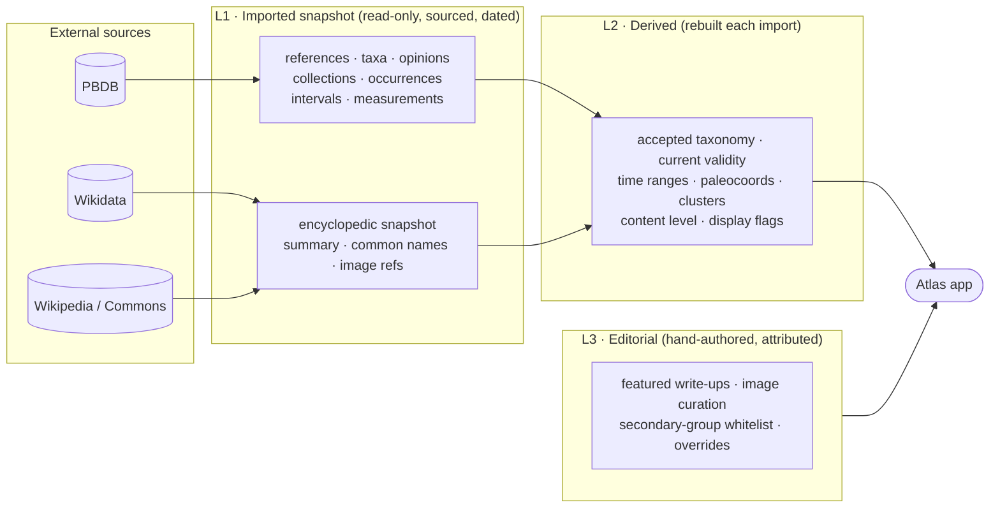
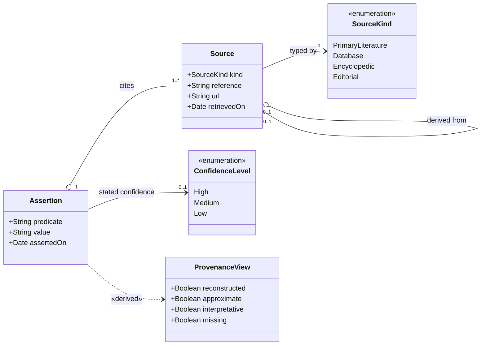
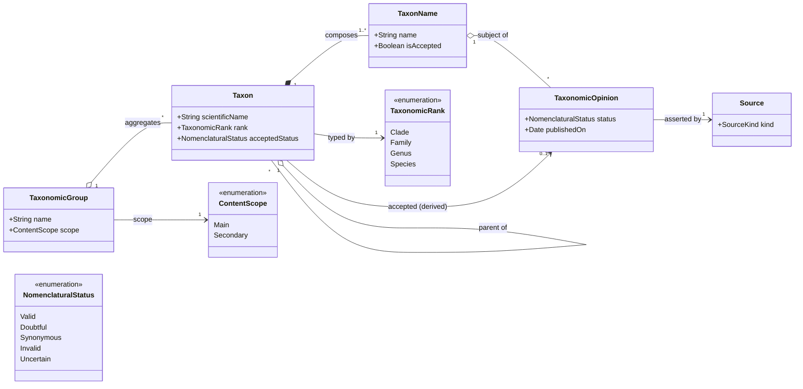
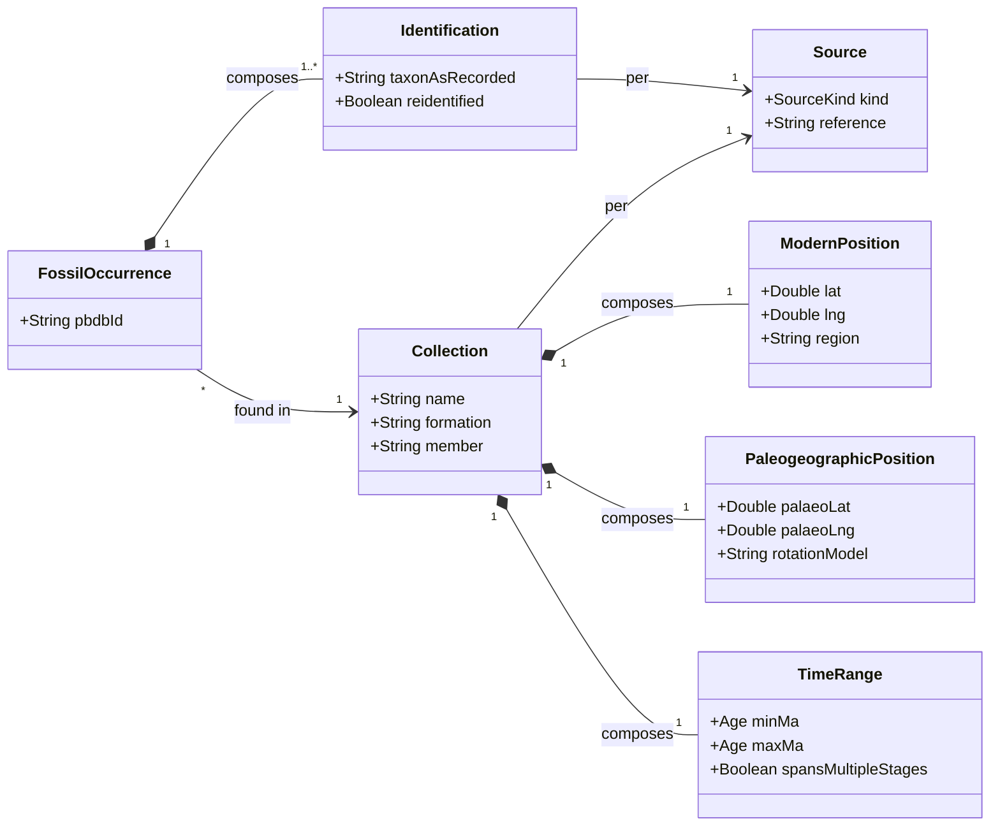
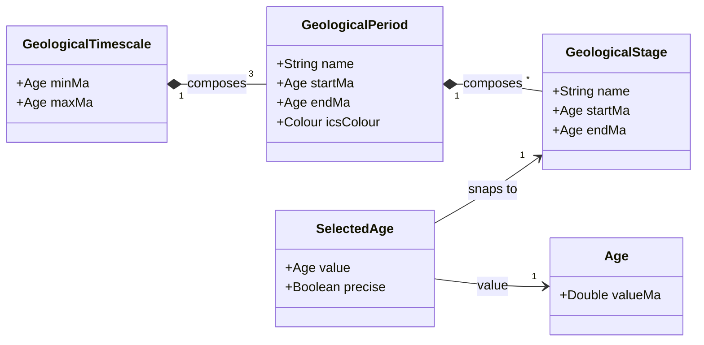
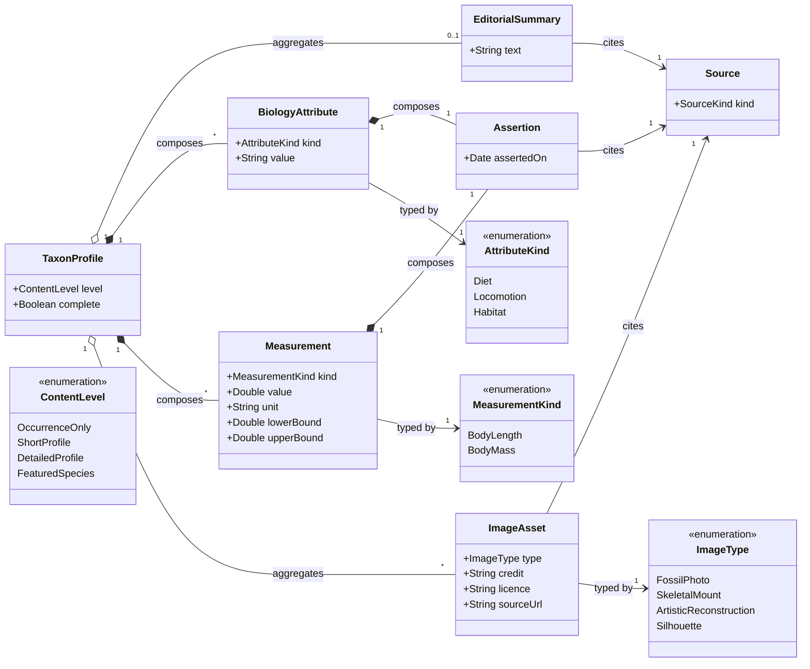
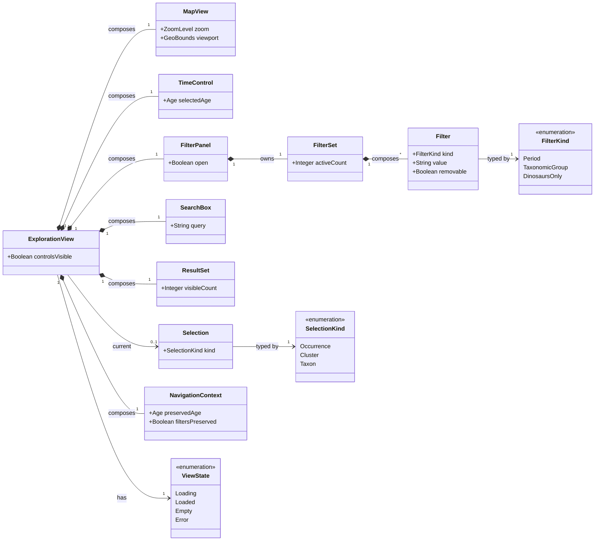
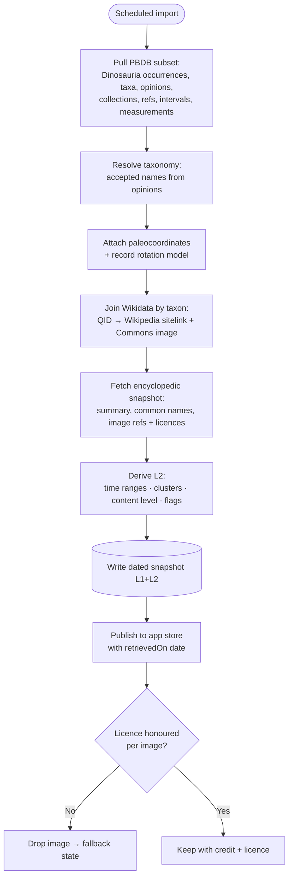

# Data architecture & model (design)

**Status:** Technical design document — the elaboration behind the **approved**
[`SPEC-001: Data architecture & model`](../specs/approved/SPEC-001-data-architecture.md).
This is **not** a source of product requirements — those live only in the
[functional specification](../product/functional-specification.md); the governed
data requirements (DATA-001…, NFR-001) live in SPEC-001. This document
records *how* the data behind the atlas is sourced, structured, and served so that
the requirements (especially the provenance and uncertainty rules of §1.11 and
§2.x) are satisfied **structurally** rather than by convention.

It fixes decisions the functional specification deliberately leaves open (e.g.
which datasets supply the data) and is the reference for the class models of the
data layer.

---

## 1. Principles

Three ideas drive everything below.

1. **The atlas is a curation & presentation layer, not a source of truth for
   paleobiology.** We do not re-derive taxonomy, dating, or plate reconstructions.
   Being a data *authority* is the single largest project risk; we avoid it by
   leaning on established datasets and adding only a thin editorial layer.
2. **Separate facts from assertions from derivations.** A datum is one of:
   - an **imported fact** (an occurrence record, a measurement) — sourced;
   - an **assertion** *about* something (validity, diet, mass) — a claim made *by a
     source, at a date*, not an intrinsic property; or
   - a **derived value** (accepted taxonomy, "approximate", "reconstructed",
     content level) — a deterministic function of the two above.
   Most of the enums that look like intrinsic attributes are really assertions or
   derivations. Modelling them that way is what makes provenance honest.
3. **Provenance is a structural invariant.** Every value the UI can display
   resolves to a `Source` (or is explicitly marked *Editorial*). It is not
   possible to render a field without a provenance pointer.

---

## 2. Sources and their roles

Two external datasets, joined through **Wikidata**.

| Source | Role | Provenance kind | Licence |
| --- | --- | --- | --- |
| **Paleobiology Database (PBDB)** | Scientific spine — occurrences, collections, taxa, **taxonomic opinions**, references, geologic intervals, measurements, and paleocoordinates | `Database` → resolves to `PrimaryLiterature` (PBDB records the citing reference) | CC0 / CC BY (per PBDB terms) |
| **Wikipedia / Wikimedia Commons** | Encyclopedic layer — narrative summary, common names, illustrations | `Encyclopedic` (tertiary) | Text CC BY-SA 4.0; images per-file (varies) |
| **Wikidata** | The **join key**, not display content — carries the PBDB taxon id, the Wikipedia sitelink, and the Commons image (P18) for a taxon | — | CC0 |

**Why Wikidata is the bridge.** Matching PBDB taxa to Wikipedia articles by name is
fragile (homonyms, synonyms, spelling). A Wikidata item for a taxon typically holds
its scientific name, a *Paleobiology Database taxon ID*, a sitelink to the
Wikipedia article, common names, and a Commons image. Joining **by Wikidata QID**
turns reconciliation into a lookup. Taxa without a Wikidata match simply have no
encyclopedic content → the UI shows the explicit "not available" state (on brand).

**Trust boundary.** Wikipedia content is **tertiary** and always labelled as such
(`SourceKind = Encyclopedic`). It must never be presented with the same editorial
status as PBDB/primary data (CONS-100, CONS-330, CONS-340). Where Wikipedia states
a numeric value (mass, length) we surface it marked tertiary; we never invent a
confidence it did not state (CONS-080, CONS-410), and we prefer the primary
reference Wikipedia itself cites when we can resolve it.

**Licensing is a hard constraint.** Displaying a Wikipedia summary requires
attribution and share-alike (CC BY-SA 4.0). Every Commons image stores its own
`licence`, `credit`, and `sourceUrl`, and is shown with them (FONC-1210); artistic
reconstructions are labelled as such (FONC-1220/1230). An image whose licence we
cannot honour is simply not shown → image-fallback state (FONC-1240).

---

## 3. Three data tiers

- **L1 — Imported snapshot.** Immutable, dated mirror of a PBDB subset plus an
  encyclopedic snapshot. Each row keeps its `Source` and the snapshot's
  `retrievedOn` date — this is where FONC-1170 / CONS-430 (import date) come from.
- **L2 — Derived.** A pure function of L1, rebuilt on every import: accepted
  taxonomy, current validity (from opinions), per-taxon time range, paleocoords,
  spatial clusters, `ContentLevel`, and the derived display flags. Never
  hand-edited.
- **L3 — Editorial.** Small, versioned, clearly attributed as *Editorial
  synthesis*: featured-species prose, image selection, the secondary-group
  whitelist (CONS-090), and rare curator overrides.

The app reads **L2 + L3 only**, at runtime, from our own store — it never calls
PBDB or Wikipedia live (see §6). That keeps performance (PERF-010…040), offline
reproducibility, and the import-date guarantee intact.

---

## 4. Provenance & the assertion pattern

The heart of the model. A claim is a first-class object with a source and a date;
"validity", "diet", "mass" are all the same shape. The UI shows the **winning**
assertion and its citation.

- **`Source.derivedFrom`** models the chain: an `Editorial` note cites an
  `Encyclopedic` article; a `Database` (PBDB) record aggregates a
  `PrimaryLiterature` reference. One flat enum could never express this.
- **`ConfidenceLevel` is optional and only ever *stated* by a source.** We do not
  compute or invent it.
- **`ProvenanceView` is `«derived»`, not stored** — the dashed dependency is the
  point. The four flags are computed from structure, so they can never drift from
  the data:

| Display flag | Derived from |
| --- | --- |
| `reconstructed` | the value is a paleocoordinate (produced by a rotation model) — true by construction |
| `approximate` | the `TimeRange` spans more than one geologic stage, or has wide bounds |
| `interpretative` | the value's `Source.kind` is `Encyclopedic` or `Editorial` (not `Database`/`PrimaryLiterature`) |
| `missing` | the value is null |

This directly answers "how would you set that value from sources": you don't set
these — you compute them.

---

## 5. Taxonomy & validity (opinion-based)

`ValidityStatus` is **not** an attribute of a taxon; it is derived from the set of
**taxonomic opinions**, each asserted by a reference at a date. This mirrors how
PBDB itself computes accepted names.

`acceptedStatus` (L2) is the status of the winning opinion. The taxon profile shows
that status **and the opinion/reference that produced it** — so "doubtful" always
comes with "according to whom, and when" (FONC-720, CONS-300, CONS-310).

---

## 6. Occurrences, collections & geography

Geography and time belong to the **collection** (a locality), and the
**occurrence** is a taxon *identified in* a collection per a reference — which is
what PBDB actually models. The old `EvidenceType` enum is dropped: "discovery
evidence, not a range" is a **display disclaimer** (FONC-1150), not a stored field.

- `PaleogeographicPosition.rotationModel` records *which* reconstruction produced
  it — so `reconstructed` is inherent to the field, and CONS-110/120/130 are
  satisfied structurally. (PBDB returns paleocoordinates; we store the model name.)
- `TimeRange.spansMultipleStages` feeds the derived `approximate` flag
  (FONC-1140, CONS-210).
- The occurrence panel presents its collection's position/time/source for the
  selected occurrence; the normalization above is what backs that view.

---

## 7. Geological time

A fixed reference table (ICS), not sourced per-row — the timescale is standard.

`SelectedAge snaps to GeologicalStage` bakes the stage-stepped time control
(§1.2) into the model.

---

## 8. Taxon profile & media (structured, sourced, sparse-by-design)

Biology is a set of **typed, nullable, sourced** attributes/measurements — not a
free-text bag and not a generic key/value store. Sparsity is expected and handled
by the explicit-missing rule and the content-level ladder.

- Each `BiologyAttribute` / `Measurement` composes an `Assertion` that cites a
  `Source` — so diet/mass carry "according to whom". Values may come from a PBDB
  measurement (primary), a Wikipedia figure (tertiary), or an editorial synthesis;
  the source kind decides whether the UI marks it *interpretative*.
- `Measurement` carries `lowerBound`/`upperBound` — uncertainty comes from the
  source, satisfying CONS-080/410 without inventing a confidence.
- `ContentLevel` is **derived** from how many of these are populated (+ presence of
  a summary/image), which is exactly the completeness ladder of FONC-430…470.
- `ImageAsset` carries `licence`/`credit`/`sourceUrl` and an `ImageType`, covering
  FONC-1190…1240.

---

## 8b. Application & view model

The runtime/view layer that the interface composes. These enums (`ViewState`,
`FilterKind`, `SelectionKind`) *are* intrinsic — a view genuinely is one of
loading/loaded/empty/error — unlike the data-layer classifications above.

`NavigationContext` is what preserves the selected age and active filters across
navigation and load failures (FONC-1010/1020/1340).

## 9. Ingestion pipeline

**Snapshot, not live.** The app serves from our own dated store; it does not query
PBDB/Wikipedia at request time. This is deliberate: it makes performance
predictable (PERF-010…060), makes the atlas resilient to upstream downtime
(PERF-280…310), and gives every field an honest, stable import date. The cost is a
periodic re-import job, which is far cheaper than the alternatives.

---

## 10. Risks & mitigations

| Risk | Mitigation |
| --- | --- |
| Becoming a paleobiology authority (taxonomy, dating, reconstruction) | Don't. Consume PBDB's accepted names, intervals, and paleocoords; store the rotation-model name for honesty. |
| PBDB ↔ Wikipedia mismatching | Join by **Wikidata QID**, not name; unmatched taxa degrade gracefully to "no encyclopedic content". |
| Wikipedia licensing / attribution | Store per-image `licence`/`credit`/`sourceUrl`; attribute + share-alike summary text; drop anything we can't honour. |
| Tertiary content read as fact | `SourceKind = Encyclopedic`; UI marks it *interpretative*; never equal editorial status to PBDB (CONS-100). |
| Sparse profiles | Designed state: explicit "not available" (FONC-490) + content-level ladder; not a bug. |
| Upstream drift / downtime | Dated snapshots; app never calls upstream live. |

---

## 11. How this satisfies the requirements

| Requirement area | Mechanism here |
| --- | --- |
| Identifiable source per occurrence/time range (FONC-1100, PERF-140/150, CONS-390/400) | Every L1 row carries a `Source`; the app can't render without one |
| Distinguish primary / database / editorial (CONS-420) | `SourceKind` + `Source.derivedFrom` chain |
| Fossil-derived vs interpretative (FONC-670, FONC-1110, CONS-440) | Derived `interpretative` flag from `Source.kind`; assertions never mixed with facts in one field |
| Reconstructed / approximate marked (FONC-1130/1140, CONS-110/210) | Derived flags from `rotationModel` and `spansMultipleStages` |
| Missing shown explicitly (FONC-490, FONC-1120, PERF-180/190) | Nullable typed fields + derived `missing` flag |
| Validity/doubtful flagged with basis (FONC-720, CONS-300/310) | `TaxonomicOpinion` + winning opinion shown with its reference |
| Content levels (FONC-430…470) | Derived `ContentLevel` from populated structured fields |
| Import/consultation date, external links (FONC-1170/1180, CONS-430) | `Source.retrievedOn`; snapshot date; `Source.url` |
| Numeric values need source/uncertainty (CONS-080/410) | `Measurement` bounds + cited `Source`; no invented confidence |
| Images typed & credited (FONC-1200…1240) | `ImageAsset.type/credit/licence/sourceUrl` |

---

## 12. Open design decisions (for a future increment)

- **Import cadence & diffing** — full re-snapshot vs. incremental; how to surface
  "updated since last import".
- **Paleocoordinate model** — accept PBDB's default rotation model, or pin a
  specific one (e.g. a named GPlates model) and record it per position.
- **Editorial featured-species workflow** — where L3 prose is authored and how it
  is reviewed (ties to the spec-first workflow).
- **Search index** — scientific-name search (MVP) and later common-name search
  (FONC-770) over the encyclopedic layer.

> This document names PBDB + Wikipedia/Wikidata as the concrete sources; the
> [functional specification](../product/functional-specification.md) stays
> source-neutral by design (it requires *an identifiable source*, not a particular
> provider).
