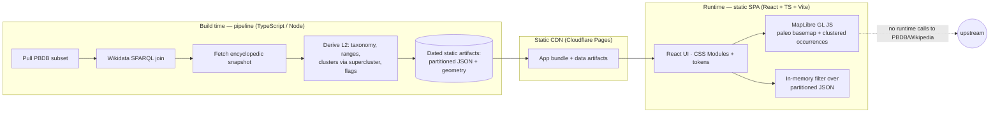

# Technology stack — decision analysis (design)

**Status:** Technical design document — the elaboration behind
[`SPEC-002: Technology stack`](../specs/approved/SPEC-002-technology-stack.md)
(Approved). This is **not** a source of product requirements —
those live only in the
[functional specification](../product/functional-specification.md). It records
*how* the atlas will be built and *why* each technical choice was made, so the
governed decisions in SPEC-002 can be reviewed against a documented rationale.

It follows the same pattern as
[`data-model.md`](data-model.md): the design doc holds the analysis; the spec
holds the normative, verifiable decisions.

> **Scope of this document.** It selects the **build stack** (languages,
> frameworks, libraries, tooling, hosting). It does **not** re-decide the data
> architecture — the sources (PBDB + Wikidata/Wikipedia), the three-tier snapshot
> model, and "no runtime upstream calls" are already fixed by
> [SPEC-001](../specs/approved/SPEC-001-data-architecture.md) and are treated here
> as **hard inputs**, not open questions.

---

## 1. What the stack has to satisfy

Every choice below is judged against constraints that already exist in the
approved specification and design. These are the fixed inputs — the "test suite"
for the stack.

| Input | Where it comes from | Consequence for the stack |
| --- | --- | --- |
| **Snapshot data, no live upstream calls** | SPEC-001 DATA-005 | The app can be a **static client** served from a CDN; no application server is required at runtime. |
| **Map-first: paleogeographic map + occurrence points/clusters, zoom/pan** | FONC-210…300, vision | Needs a real map/geo rendering engine with clustering and smooth zoom/pan. |
| **Pre-rotated paleocoordinates come from PBDB** | data-model §6 | The runtime does **not** reproject; it draws already-reconstructed geometry. This removes "runtime projection engine" from the requirements. |
| **Performance budgets** | PERF-010…060 | View ≤5 s, first content ≤3 s, occurrence update ≤1 s, map feedback ≤100 ms. Bundle size and render performance are graded, not free. |
| **Map density / clustering** | PERF-090/100/120 | ≥30 markers per 100×100 px must cluster; targets ≥24×24 px. Clustering must be first-class. |
| **Accessibility: keyboard, contrast, not-colour-only** | PERF-220…270 | Tooling must include a11y linting and testing; the UI layer must not fight it. |
| **Binding design charter: single light theme, design tokens, specific fonts, meaning-only status colours** | [design-guidelines.md](../mockups/design-guidelines.md) | Styling must encode a bespoke token system cleanly; a framework with strong opinions about colour/spacing is a liability, not a help. |
| **Provenance/licence rendering (CC BY-SA attribution, per-image credit)** | SPEC-001 DATA-007 | Purely a UI concern — no special stack requirement beyond "we control the markup". |
| **Solo, spec-first project; repo is source of truth** | CLAUDE.md, AGENT_WORKFLOW | Favor **low operational burden**, mainstream ecosystems, and one language where reasonable. Cleverness that only one person must maintain is a cost. |

### Reading the comparison tables

Difficult choices are scored per category on a three-colour scale. **Red is
disqualifying** — a single red rules an option out for this project, regardless
of its other scores. Every cell carries a word as well as a colour, so the tables
do not rely on colour alone (consistent with PERF-250).

| Symbol | Meaning |
| --- | --- |
| 🟢 **Strong** | Meets the need well; a reason to choose this option. |
| 🟠 **Caveat** | Usable, but with a real weakness, extra work, or risk to manage. |
| 🔴 **Disqualifying** | A blocker for *this* project's constraints. One red eliminates the option. |

---

## 2. Foundational decision: a static client, no runtime backend

Because SPEC-001 fixes the data as a **dated snapshot the app reads from our own
store, never calling PBDB/Wikipedia at request time** (DATA-005), the runtime has
no need for an application server. The "backend" of this project is an **offline
build/ingestion pipeline** that produces versioned, read-only data artifacts; the
"frontend" is a static single-page app that loads them from a CDN.

| Architecture | Perf/latency | Ops burden & cost | Fit to SPEC-001 snapshot | Resilience | Verdict |
| --- | --- | --- | --- | --- | --- |
| **Static SPA + prebuilt artifacts on CDN** *(chosen)* | 🟢 CDN-edge, no server round-trip | 🟢 No servers to run/patch; free tiers cover it | 🟢 Exactly the snapshot model | 🟢 No live dependency to fail (PERF-280…310) | **Chosen** |
| SPA + thin read API (Node/Python + Postgres) | 🟢 Fast if cached | 🟠 A server + DB to run, secure, and pay for | 🟠 Redundant — re-serves what the snapshot already froze | 🟠 One more thing that can be down | Rejected for MVP — unjustified given DATA-005 |
| SSR / full-stack framework (Next/Nuxt server) | 🟢 Good TTFB | 🔴 Requires a running server/edge functions for no runtime data need | 🟠 Fights "no live calls" | 🟠 Server is a live dependency | Rejected — server we do not need |

**Consequence.** The map is a **2-D paleogeographic view** (a 3-D globe is an
explicit product non-goal, spec §5), rendered client-side from prebuilt geometry.
This single decision cascades into every choice below: we optimize for a
**fast-loading, static, client-rendered SPA**, not for a server runtime.

---

## 3. Difficult choice A — Map rendering engine *(the headline decision)*

This is the highest-stakes, most domain-specific choice. The engine must render a
**custom paleogeographic basemap** (reconstructed continents per age — not a
standard web-Mercator street map), draw and **cluster** fossil-occurrence points,
give **smooth GPU zoom/pan** within the 100 ms feedback budget, and be **styleable**
into the charter's pale bathymetric look with a single teal data layer. Crucially,
because PBDB supplies **pre-rotated paleocoordinates** (data-model §6), we do *not*
need runtime reprojection — geometry is drawn on a simple equirectangular canvas —
which changes the weighting: raw projection power matters less than clustering,
performance, and styling control.

### Candidates

- **MapLibre GL JS** — GPU vector renderer (BSD-3, community fork of pre-proprietary
  Mapbox GL); built-in GeoJSON clustering; data-driven styling; PMTiles support.
- **Leaflet** — mature, lightweight, raster-first; clustering via
  `Leaflet.markercluster`; arbitrary coordinates via `L.CRS.Simple`.
- **OpenLayers** — the most powerful projection/GIS engine; vector + raster;
  heavier API and bundle.
- **D3-geo (+ canvas)** — total cartographic control; but pan/zoom, hit-testing,
  and clustering are all hand-built.
- **deck.gl** — GPU layers for very large point sets; WebGL-heavy; basemap styling
  and DOM interop are more work.

### Comparison

| Category (why it matters) | MapLibre GL *(chosen)* | Leaflet | OpenLayers | D3-geo + canvas | deck.gl |
| --- | --- | --- | --- | --- | --- |
| **Custom paleo basemap** (draw our own reconstructed coastlines, not a street map) | 🟢 GeoJSON/vector source, full restyle | 🟢 GeoJSON layer, `CRS.Simple` | 🟢 Any projection, vector | 🟢 Best-in-class control | 🟠 Basemap is your problem |
| **Clustering & density** (PERF-090/100/120) | 🟢 Built-in cluster source (supercluster) | 🟢 Solid plugin | 🟢 Built-in cluster source | 🔴 Hand-build clustering + hit-testing | 🟠 Aggregation layers, more code |
| **Zoom/pan performance** (PERF-060, ≤100 ms) | 🟢 GPU, 60 fps | 🟠 DOM/raster, fine at MVP scale, degrades with many vectors | 🟢 Canvas/WebGL | 🟠 Canvas OK; you tune it | 🟢 GPU, huge scale |
| **Styling to the charter** (bathymetric, teal, ICS, data-driven) | 🟢 Data-driven style expressions | 🟠 CSS/plugin styling, less expressive | 🟢 Expressive but verbose | 🟢 Full control (it's your draw code) | 🟠 Layer props, less cartographic |
| **Bundle / load budget** (PERF-010/020) | 🟠 ~200 KB gz — acceptable, dominates our bundle | 🟢 ~40 KB gz | 🟠 ~150–250 KB gz | 🟢 Small core | 🔴 Large + WebGL weight for an MVP |
| **Accessibility / keyboard** (PERF-230/270) | 🟠 Needs deliberate a11y work (canvas) | 🟠 DOM markers easier to make focusable | 🟠 Canvas, deliberate work | 🟠 You own all of it | 🔴 Canvas-only, hardest to make accessible |
| **Ecosystem & maturity** | 🟢 Active, large, well-documented | 🟢 Very mature | 🟢 Mature, enterprise GIS | 🟢 Mature (but low-level) | 🟠 Younger, niche |
| **Licence** (must be permissive OSS) | 🟢 BSD-3 (free, no token) | 🟢 BSD-2 | 🟢 BSD-2 | 🟢 ISC | 🟢 MIT |
| **Build-your-own burden** (solo project) | 🟢 Batteries included | 🟢 Low | 🟠 More API surface | 🔴 Very high (interaction, perf, clustering) | 🟠 High |

### Decision — **MapLibre GL JS**

It is the only candidate that is 🟢 on **all three** of the properties this app
lives or dies by — clustering, GPU zoom/pan, and data-driven styling — while
staying permissively licensed and drawing a fully custom (non-street-map)
basemap. Its two 🟠s are **bundle size** (~200 KB gzip, comfortably inside the
5 s / 3 s budgets, and it will be the single largest dependency either way) and
**canvas accessibility** (addressed by keyboard controls + an accessible
list/panel path to every occurrence, which we need for the ≤2-action rule
regardless of engine).

- **Leaflet** is the honest runner-up and the **documented fallback**: if MapLibre's
  bundle or GPU footprint ever becomes a problem, Leaflet + `markercluster` +
  `CRS.Simple` renders our pre-rotated points on a custom image/GeoJSON world at
  MVP scale. Its 🟠s (vector-scale performance, less expressive styling) are the
  reasons it is second, not first.
- **OpenLayers** — no red, but its projection power is the one thing we don't need
  (PBDB pre-rotates), and it costs more API surface and bundle for that unused
  strength.
- **D3-geo** and **deck.gl** are **ruled out by a red**: D3-geo makes us hand-build
  clustering/interaction (unjustifiable solo build cost); deck.gl's bundle/WebGL
  weight and canvas-only accessibility are disqualifying for an MVP with these
  budgets and a11y requirements.

> **Note (licence angle).** Mapbox GL JS v2+ is *not* a candidate: it is
> proprietary-licensed and requires an access token/telemetry — incompatible with
> a static, no-account, no-runtime-egress app. MapLibre is the free BSD fork and
> avoids that entirely.

---

## 4. Difficult choice B — Application framework

The app is a **single interactive SPA** (one exploration view + profile/panel
routes). It does **not** need SSR, server components, or a content-site generator —
the data is static and prebuilt. So the framework is judged on client bundle,
ecosystem (especially map + testing + a11y libraries), TypeScript quality, and
long-term maintainability for a solo dev.

### Candidates: React, Svelte/SvelteKit, Vue, SolidJS, Astro

| Category | React + Vite *(chosen)* | SvelteKit / Svelte | Vue | SolidJS | Astro |
| --- | --- | --- | --- | --- | --- |
| **Bundle / runtime cost** (PERF budgets) | 🟠 Larger runtime (~45 KB gz), fine within budget | 🟢 Compiled, tiny | 🟠 Middle | 🟢 Very small, fast | 🟢 Ships ~zero JS by default |
| **Ecosystem & libraries** (maps, a11y, testing) | 🟢 Largest; every map/a11y/test lib targets it first | 🟠 Growing, smaller | 🟢 Large | 🟠 Small | 🟠 Content-first, thinner app ecosystem |
| **Map-engine integration** | 🟢 Abundant MapLibre/React patterns | 🟢 Works, fewer examples | 🟢 Works | 🟠 Fewer examples | 🟠 Island model awkward for one big stateful map |
| **TypeScript quality** | 🟢 Excellent | 🟢 Good | 🟢 Good | 🟢 Excellent | 🟢 Good |
| **Fit: single stateful SPA** | 🟢 Ideal | 🟢 Ideal (use Svelte, not the server bits) | 🟢 Ideal | 🟢 Ideal | 🔴 Islands/MPA fights one large interactive view |
| **Testing tooling** (Vitest, Testing Library, Playwright) | 🟢 First-class, most examples | 🟢 Good | 🟢 Good | 🟠 Thinner | 🟠 Thinner for app logic |
| **Maintainability / references for a solo dev** | 🟢 Deepest docs, largest talent/AI-assist base | 🟠 Smaller pool | 🟢 Large | 🟠 Small pool | 🟠 Newer patterns |
| **Longevity / stability** | 🟢 Very stable | 🟢 Stable | 🟢 Very stable | 🟠 Younger | 🟢 Stable |

### Decision — **React + TypeScript + Vite** (SPA, no SSR)

The app is a single stateful SPA where **ecosystem depth** (map integration, a11y
tooling, testing) and **maintainability** matter more than shaving the last
kilobytes — and the map engine, not the framework, dominates the bundle anyway.
React's only 🟠 is runtime size, which is comfortably inside the PERF budget.
**SvelteKit is the strong runner-up** (smaller bundle, excellent DX); it loses on
ecosystem/reference depth for a solo project, and its bundle-size edge is not
decisive when MapLible is the heavy dependency. **Astro is ruled out by a red**:
its islands/MPA model is the wrong shape for one large, continuously interactive
map view. Vite is the build tool in all live cases; we use React's SPA output
(static assets), not any server runtime.

---

## 5. Difficult choice C — Client data delivery & query format

The app must filter tens of thousands of occurrences by **age overlap**, **period**,
and **taxonomic group**, and update the map in ≤1 s (PERF-030). The data is
prebuilt and static (SPEC-001). The question is the **on-the-wire format and where
the query runs**. Map geometry (points + coastlines) and attribute/profile data
can use different mechanisms.

### Candidates

- **Partitioned static JSON** — prebuilt JSON split by geological stage/period,
  loaded on demand; filtering runs in-memory in JS; clusters precomputed at build.
- **SQLite-wasm** — ship a `.sqlite` file, query with SQL in the browser
  (range-requestable); indexed filtering.
- **DuckDB-wasm** — analytical engine over Parquet in the browser; powerful
  aggregation; multi-MB wasm.
- **PMTiles (vector)** — single-file tiled vector geometry over HTTP range
  requests; pairs natively with MapLibre for map rendering at scale.

| Category | Partitioned JSON *(chosen for MVP)* | SQLite-wasm | DuckDB-wasm | PMTiles *(map layer, scaling path)* |
| --- | --- | --- | --- | --- |
| **Fit to MVP data volume** (dinosaurs-only subset) | 🟢 Small enough to partition & load fast | 🟢 Handles it | 🟠 Overkill | 🟢 For geometry at scale |
| **Query needs** (age/period/group filters, PERF-030) | 🟢 In-memory JS filter is trivially fast on the loaded partition | 🟢 SQL indexes | 🟢 SQL, heaviest queries | 🟠 Geometry, not attribute queries |
| **Bundle / payload weight** (PERF-010/020) | 🟢 No engine to ship; gzipped JSON | 🟠 ~1 MB wasm engine | 🔴 Multi-MB wasm for an MVP | 🟢 Tiny client, range-requested |
| **Complexity / ops** (solo, static) | 🟢 Plain files, no engine | 🟠 Engine + query layer | 🔴 Heavy engine + Parquet build | 🟠 Tile build step |
| **Scaling headroom** (V1 secondary groups, more data) | 🟠 Needs partition strategy tuning | 🟢 Scales well | 🟢 Scales furthest | 🟢 Scales furthest for geometry |
| **Static-CDN friendliness** | 🟢 Just files | 🟢 One file (range) | 🟢 Files (range) | 🟢 One file (range) |

### Decision — **partitioned static JSON for MVP; PMTiles as the geometry scaling path**

For a **dinosaurs-only** MVP the occurrence set is small enough that prebuilt JSON,
partitioned by geological stage/period with **precomputed clusters**, loads fast
and filters in-memory well within PERF-030 — with **no query engine to ship**
(the decisive win against SQLite/DuckDB-wasm, which add megabytes of wasm we don't
need yet). **DuckDB-wasm is effectively ruled out for MVP by a red** on payload
weight/complexity — it is an analytics engine for a filtering problem. The map's
point/coastline geometry uses MapLibre's native **GeoJSON + client clustering** at
MVP volume; **PMTiles** is the documented, no-server scaling path when V1 adds
secondary groups and geometry volume grows. SQLite-wasm is the fallback if
attribute queries later outgrow in-memory filtering. Clustering is precomputed
with **supercluster** (the same algorithm MapLibre uses) so the map and the data
layer agree.

---

## 6. Difficult choice D — Ingestion / build pipeline language

The pipeline (SPEC-001 §9) pulls a PBDB subset, runs a Wikidata SPARQL join,
fetches an encyclopedic snapshot, derives L2 (accepted taxonomy, time ranges,
clusters, content level, flags), and writes a dated snapshot. Batch, offline. The
choice is **Python vs TypeScript/Node**.

| Category | TypeScript / Node *(chosen)* | Python |
| --- | --- | --- |
| **Single language across repo** | 🟢 One toolchain; app is already TS | 🟠 Second language + toolchain to maintain (solo cost) |
| **Shared domain model** (SPEC-001 classes) | 🟢 Reuse the app's TS types end-to-end | 🔴 Domain model duplicated/redefined — drift risk between pipeline and app |
| **Data/ETL ergonomics** | 🟠 Adequate (fetch, JSON, CSV libs) | 🟢 Best-in-class (pandas et al.) |
| **Geo processing need** | 🟢 Low — PBDB pre-rotates; clustering via **supercluster** (JS) | 🟢 shapely/geopandas (power we don't need here) |
| **Wikidata SPARQL / REST calls** | 🟢 Trivial (fetch + a SPARQL client) | 🟢 Trivial |
| **Determinism / reproducibility** (NFR-001) | 🟢 Achievable | 🟢 Achievable |

### Decision — **TypeScript / Node**

The deciding factor is the **shared domain model**: SPEC-001's classes are the
contract between pipeline output and app input, and expressing them **once in TS**
eliminates the drift risk that a Python pipeline would carry (its only 🔴). The
usual reason to reach for Python here — heavy geo/data processing — is largely
absent: **PBDB pre-rotates paleocoordinates**, and clustering is done with
**supercluster** (a JS library), so the geo workload is light. Python's real
strength (pandas/geopandas) would be paying for power we don't use with a second
toolchain a solo maintainer must keep alive. Python remains a reasonable choice if
the pipeline later grows heavy analytical/geo steps; that would be a deliberate,
recorded change.

---

## 7. Difficult choice E — Styling approach

The [design charter](../mockups/design-guidelines.md) is unusually specific: a
**single light theme**, an explicit **design-token table**, named **font stacks**,
**meaning-only** status colours, and deliberate restraint. Styling is judged on how
faithfully and cheaply it encodes *that* system — a framework with strong built-in
opinions about colour/spacing is a liability here, not a shortcut.

| Category | CSS Modules + design tokens *(chosen)* | Tailwind CSS | CSS-in-JS (styled/emotion) | Vanilla-Extract |
| --- | --- | --- | --- | --- |
| **Encodes the charter's token table directly** | 🟢 CSS custom properties = the tokens, 1:1 | 🟠 Must reconfigure Tailwind's scale to the tokens; fights defaults | 🟢 Tokens in JS | 🟢 Typed tokens, 1:1 |
| **Runtime cost** (PERF budgets) | 🟢 Zero runtime | 🟢 Zero runtime | 🔴 Runtime styling cost | 🟢 Zero runtime (build-time) |
| **Bespoke cartographic look** (not a utility aesthetic) | 🟢 Full control | 🟠 Utility classes bias toward generic looks | 🟢 Full control | 🟢 Full control |
| **Domain-legible markup** (charter §3 wants domain language, not class soup) | 🟢 Semantic class names | 🟠 Long utility strings obscure intent | 🟢 Named components | 🟢 Semantic |
| **Type-safety of tokens** | 🟠 Plain CSS vars (lint-checked) | 🟠 Config-driven | 🟢 Typed | 🟢 Typed |
| **Learning/build overhead** | 🟢 Minimal, native | 🟢 Familiar but config to match tokens | 🟠 Extra dep + runtime | 🟠 Build integration |

### Decision — **CSS Modules + design tokens (CSS custom properties)**

It maps **one-to-one** onto the charter's token table with **zero runtime cost**
and full control over the bespoke bathymetric look — no framework opinions to
override. **Tailwind is not disqualified** (no red) but earns 🟠s that matter
*here specifically*: you would reconfigure its scale to the tokens anyway, its
utility bias nudges toward a generic aesthetic, and long class strings work against
the charter's "domain-legible" intent. **CSS-in-JS is ruled out by a red** on
runtime cost against tight PERF budgets. **Vanilla-Extract** is the upgrade path if
typed tokens become worth the build integration — same model, statically typed.

---

## 8. Confirmed choices that were not close calls

These follow from the decisions above or from the project constraints, and did not
warrant a full matrix. Each is governed by a requirement in SPEC-002.

| Concern | Choice | Why (short) |
| --- | --- | --- |
| **Language** | **TypeScript** (strict) | Type-safe domain model shared app↔pipeline; industry default. |
| **Package manager** | **pnpm** | Fast, disk-efficient, strict dependency resolution. (npm acceptable.) |
| **Unit / component tests** | **Vitest + @testing-library/react** | Vite-native, fast; component tests for the required UI states (FONC-1260…1340). |
| **End-to-end tests** | **Playwright** | Drives the MVP validation scenarios (PERF-340…370); already available in the environment. |
| **Accessibility testing** | **axe** (`@axe-core/playwright`, `jest-axe`) | Automated checks for PERF-240/250/270; a11y is a hard requirement. |
| **Lint / format** | **ESLint (+ `eslint-plugin-jsx-a11y`) + Prettier** | jsx-a11y earns its place because keyboard/contrast/not-colour-only are required. Biome noted as a faster single-tool alternative but lacks mature a11y rules. |
| **CI** | **GitHub Actions** | Already present (`governance.yml`); add build + lint + test + a11y jobs. |
| **Hosting** | **Static CDN — Cloudflare Pages** (Netlify/Vercel/GitHub Pages equivalent) | Free tier, global edge, HTTP range-request support (useful for PMTiles later). No server, matching §2. |
| **Snapshot artifact storage** | Versioned static artifacts (git-LFS or object storage such as R2), each carrying `retrievedOn` | Serves SPEC-001 DATA-005 / NFR-001 without a database. |
| **Runtime Node** | Current **LTS** | Stability for the pipeline and tooling. |
| **Analytics / telemetry** | **None** at MVP | Charter forbids fake metrics; no runtime egress; privacy by default. |

---

## 9. The stack, end to end

- **One language (TypeScript)** spans the pipeline and the app, with the SPEC-001
  domain model expressed once.
- **No server at runtime** — the app is static files on a CDN reading prebuilt,
  dated artifacts (SPEC-001 DATA-005).
- **MapLibre GL JS** renders the pre-rotated paleogeography and clusters
  occurrences; **supercluster** precomputes clusters so build and runtime agree.
- **CSS Modules + tokens** encode the design charter with zero runtime cost.
- **Vitest + Playwright + axe** verify component states, the end-to-end MVP
  scenarios, and accessibility.

---

## 10. How the stack satisfies the constraints

| Constraint (source) | Mechanism in this stack |
| --- | --- |
| Snapshot, no live calls (SPEC-001 DATA-005) | Static SPA + prebuilt artifacts on a CDN; no runtime backend (§2). |
| Map + clustering + zoom/pan (FONC-210…300, PERF-060/090/100/120) | MapLibre GL JS: GPU render, built-in clustering, ≤100 ms feedback (§3). |
| Performance budgets (PERF-010…060) | Static CDN delivery; partitioned JSON loaded on demand; in-memory filtering ≤1 s (§5). |
| Accessibility (PERF-220…270) | ESLint jsx-a11y + axe in CI; accessible list/panel path to every occurrence; not-colour-only status (§3, §8). |
| Design charter (single light theme, tokens, fonts, meaning-only colour) | CSS Modules + CSS custom properties, no framework opinions to override (§7). |
| Licence/attribution rendering (SPEC-001 DATA-007) | We control the markup (React); no special engine needed. |
| Reproducible dated snapshots (SPEC-001 NFR-001) | TS pipeline writes immutable, `retrievedOn`-dated artifacts (§6, §8). |
| Solo, low-ops, spec-first (CLAUDE.md) | One language, mainstream ecosystems, no servers, free-tier hosting. |
| Permissive-OSS only | React (MIT), MapLibre (BSD-3), Vite (MIT), Vitest/Playwright (MIT/Apache), supercluster (ISC) (§11). |

---

## 11. Risks & mitigations

| Risk | Mitigation |
| --- | --- |
| MapLibre bundle/GPU footprint hurts the load budget | It's the single largest dep either way and fits the budget; **Leaflet + markercluster** is the documented fallback (§3). |
| Canvas map is hard to make accessible | Keyboard map controls **plus** an accessible list/panel path to every occurrence (needed for ≤2-action navigation regardless). |
| Data outgrows in-memory JSON filtering (V1 secondary groups) | Documented scaling path: **PMTiles** for geometry, **SQLite-wasm** for attribute queries (§5) — no architecture change, still no server. |
| Two-language drift (pipeline vs app) | Avoided by choosing **TypeScript** for both, single domain model (§6). |
| Design system diluted by a utility framework | **CSS Modules + tokens** chosen precisely to avoid this (§7). |
| Vendor lock-in on hosting | Static output is portable across any CDN (Cloudflare/Netlify/Vercel/Pages) with no code change (§8). |

---

## 12. Open technical decisions (deferred, not blocking)

- **Snapshot storage medium** — git-LFS vs object storage (e.g. Cloudflare R2) for
  the dated artifacts; both satisfy DATA-005/NFR-001. Decide at pipeline build.
- **Typed styling upgrade** — adopt Vanilla-Extract if typed tokens prove worth the
  build integration (§7); same token model.
- **Map geometry format at scale** — when to switch occurrence/coastline geometry
  from GeoJSON to **PMTiles** (§5).
- **Paleocoastline vector source** — which reconstruction supplies the *continental
  outlines* per age for the basemap (PBDB gives point paleocoords, not coastlines);
  ties to SPEC-001's open "plate-rotation model" question.
- **State management library** — whether URL state + React context suffices or a
  small store (e.g. Zustand/nanostores) is warranted; deferred until the component
  tree exists.

> This document names the concrete build stack; the
> [functional specification](../product/functional-specification.md) stays
> technology-neutral by design. The normative, verifiable form of these decisions
> is in [SPEC-002](../specs/approved/SPEC-002-technology-stack.md).
