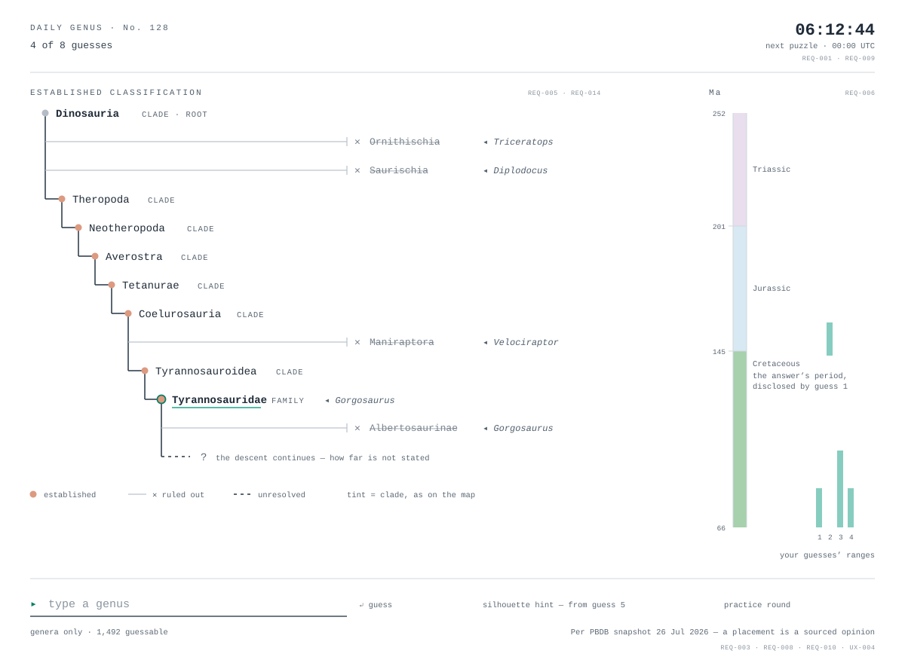
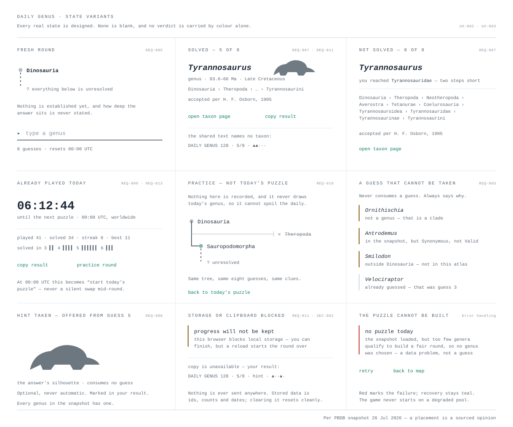

# Screen: Daily Genus

> Mockup page. Status: **High-fidelity mockup**. Convention: see
> [README](README.md); visual system in [design-guidelines.md](design-guidelines.md).
> This page introduces no requirements — they live only in
> [SPEC-019](../specs/approved/SPEC-019-daily-genus-puzzle.md).

One hidden genus a day, guessed in at most eight tries. Every guess is a genus;
what comes back is the deepest clade the guess shares with the hidden one, and
the branch of the tree that guess has ruled out. The tree the player assembles
from those answers is the screen's primary object.

## Related requirements

Governed entirely by [SPEC-019](../specs/approved/SPEC-019-daily-genus-puzzle.md):
REQ-001…REQ-014, NFR-001…NFR-004, SEC-001/002, DATA-001, API-001, UX-001…UX-004.
The charter rules it must honour are carried in that spec as UX-001 (visual
system and vocabulary) and UX-004 (classification shown as sourced, not settled).

## The scenario in the mockup

Both sheets are drawn from the **shipped snapshot**, not invented. The hidden
genus is *Tyrannosaurus*, four guesses in:

| # | Guess | Deepest shared clade | Ruled out | Time |
| --- | --- | --- | --- | --- |
| 1 | *Triceratops* | `Dinosauria` | `Ornithischia` | overlaps |
| 2 | *Diplodocus* | `Dinosauria` | `Saurischia` | answer is younger |
| 3 | *Velociraptor* | `Coelurosauria` | `Maniraptora` | overlaps |
| 4 | *Gorgosaurus* | `Tyrannosauridae` | `Albertosaurinae` | overlaps |

The confirmed spine is therefore `Dinosauria › Theropoda › Neotheropoda ›
Averostra › Tetanurae › Coelurosauria › Tyrannosauroidea › Tyrannosauridae`,
with the descent below it unresolved. Two guesses in three land on `Dinosauria`
in real play, which is why the elimination — not the shared clade alone — is what
the layout gives weight to.

## Expected contents

- **Puzzle identity and budget** — puzzle number, guesses used of eight
  (SPEC-019 REQ-007).
- **Countdown** — time to the next 00:00 UTC, the same reset worldwide
  (REQ-001, REQ-009).
- **The revealed tree** — confirmed ancestors as a filled spine, ruled-out
  branches as struck-through chips naming the guess that eliminated them, and a
  dashed unresolved continuation (REQ-005). Rooted at `Dinosauria` (REQ-014).
- **Guess input** — autocomplete over the 1,492 valid non-avian genera; genera
  only (REQ-003).
- **Guess history** — each guess with its shared clade and rank, and a marker on
  the guess that advanced the tree (REQ-004).
- **Time clue** — older / younger / overlapping, with the answer's period
  disclosed only once a guess overlaps it (REQ-006).
- **Silhouette hint** — offered from guess 5, optional, marked when shared
  (REQ-008).
- **Practice entry** — a round that does not touch the daily (REQ-010).
- **Provenance** — the snapshot date on the screen, and `acceptedPer` on the
  answer reveal (UX-004).

## What the screen deliberately does not show

- **No depth and no distance.** Neither how deep the answer sits below
  `Dinosauria` nor how many steps remain (REQ-004). Working that out is the game.
- **No siblings.** Only nodes a guess has touched are drawn. `Dinosauria` has 26
  direct children in the snapshot — mostly ichnotaxa and ootaxa — so enumerating
  them would read as database noise *and* leak the answer by elimination
  (REQ-005).
- **No diet, size, or geography clue.** Diet was cut by owner decision; PBDB
  measurements are empty on every profile; per-taxon geography is not on the
  profile (SPEC-019 Non-goals).

## States

All nine panels are in `daily-genus-states.svg`, covering SPEC-019 UX-002:

| State | Shown | Requirement |
| --- | --- | --- |
| Fresh round | Root node plus dashed continuation, nothing else | REQ-005 |
| Solved | Reveal, taxon-page handoff, spoiler-free share text | REQ-007, REQ-011 |
| Not solved | Same reveal, full descent, how far the player got | REQ-007 |
| Already played today | Result recap, record, countdown to the next puzzle | REQ-009, REQ-013 |
| Practice round | Labelled as not the daily; nothing recorded | REQ-010 |
| Guess not taken | The three rejection reasons, plus already-guessed | REQ-003 |
| Hint taken | Silhouette revealed, marked, no guess consumed | REQ-008 |
| Storage or clipboard blocked | Plays on, says progress will not be kept | REQ-011, SEC-002 |
| Puzzle cannot be built | Error with retry; never starts on a degraded pool | Error handling |

## Notes on the visual system

- **Typography** follows the shipped app, not the earlier mockups: a single
  monospace (`'Courier New'`), per the owner override of 2026-07-27 recorded in
  [design-guidelines.md](design-guidelines.md) §4 and `src/app/styles/tokens.css`.
- **Clade tints** are reused from the map (`mapCladeMarkers.ts`) so the same hue
  means the same clade across screens — theropod `#dc9a80`, sauropod `#82b6a7`,
  neutral `#b4bcc6` for the root. Shape and name carry identity first; the tint
  only reinforces, and is never the sole carrier of a state.
- **Teal stays the only accent**, on the data and interaction layer: the guess
  button, the guess that advanced the tree, and the recovery action on the error
  panel.
- **Status colours are meaning-only** — the ICS Cretaceous green on the period
  chip, muted amber for a guess that cannot be taken, red only for the load
  failure.
- **Tree states are shapes, not colours**: filled, struck through, dashed — each
  also named in words (UX-003).

## TODO

- [x] High-fidelity mockup: `../assets/mockups/daily-genus.svg`.
- [x] State sheet covering UX-002: `../assets/mockups/daily-genus-states.svg`.
- [ ] Narrow-viewport (phone) layout — the two panels stack; not yet drawn.
- [ ] Keyboard focus order and live-region placement, to be confirmed against
      the axe gate during implementation (UX-003).
