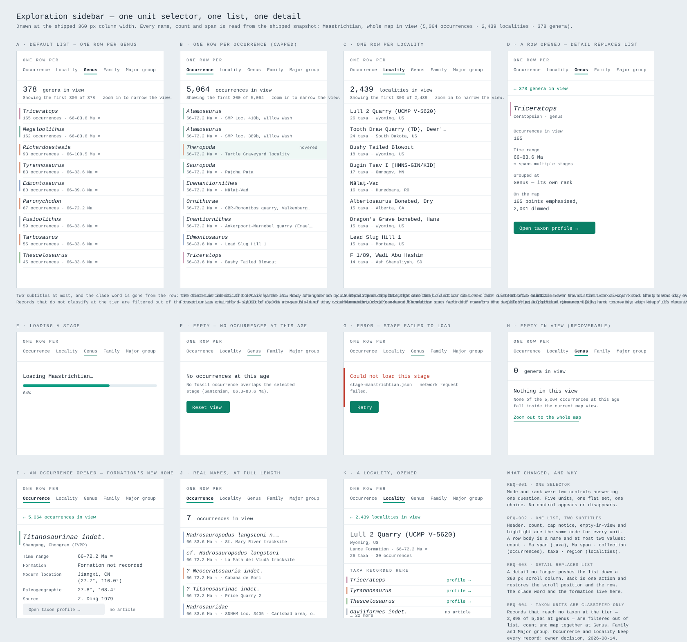

# Screen: Exploration sidebar (redesign)

The right-hand column of the exploration view — the surface that answers "what
is a row, and what did I just pick?". This page documents the redesign proposed
by [SPEC-026](../specs/active/SPEC-026-sidebar-redesign.md); it introduces no
requirements of its own.



Binding on [`design-guidelines.md`](design-guidelines.md) (the charter) and read
alongside [`anti-slop-checklist.md`](anti-slop-checklist.md).

## Related requirements

- **SPEC-010** REQ-001 (grouping-mode control), REQ-003 (locality rows collapse a
  collection with a distinct-taxon count), REQ-004 (taxon rows carry an
  occurrence count and an aggregate Ma span; hover linkage), REQ-005 (rank
  roll-up and the disclosed *not classified at this level* bucket), UX-001
  (domain language, all states designed). SPEC-026 changes the *carrier* of
  REQ-001/005 and pins the REQ-005 bucket; the amendment blocks are in SPEC-026.
- **SPEC-009** REQ-003/004 — the viewport-linked list, its render cap and
  overflow line, and the two-way map↔list highlight.
- **SPEC-003** REQ-006/007 — selection → panel → profile, and the single-action
  way back.
- **SPEC-013** REQ-004 — a chosen search result lands as a selected taxon in this
  column, at the tier that holds it.
- Charter **§2** (uncertainty first-class), **§3** (domain language), **§4**
  (one teal accent, clade tints are meaning-only), **§6** (long, messy, missing
  real data), **§7** (every real state), **§8** (interaction contract).
- Functional spec: FONC-040/050/060 (permanent context), FONC-1280 (empty),
  FONC-1310/1330 (error + retry), PERF-120 (target size), PERF-250 (never
  colour-only).

## The scenario in the mockup

Everything drawn is read from the shipped snapshot (`public/data`), stage
**Maastrichtian**, with the whole map in view. No number and no name is invented:

| Figure | Value | Where it comes from |
| ------ | ----- | ------------------- |
| Occurrences at this age | 5,064 | `stage-maastrichtian.json` |
| Localities (collections) | 2,439 | distinct `collectionId` |
| Genera | 379, with **2,898 records (57 %) not classified at genus** | `resolveTierTaxon` at the genus tier |
| Families | 74, 1,951 records (39 %) not classified | genus tier → family tier |
| Major groups | 16, 532 records (11 %) not classified | curated `MAJOR_GROUP_NAMES` |
| Largest genus | *Triceratops*, 165 occurrences, 66–83.6 Ma | fold over the stage |
| Largest locality | Lull 2 Quarry (UCMP V-5620), 26 taxa / 30 records | fold over `collectionId` |

Two things fell out of using real data rather than plausible data, and both
changed the design:

1. **At the genus tier the "not classified" bucket is the single biggest group
   in the atlas — 2,898 of 5,064 records.** Sorted last, it lands at row 380,
   past the 300-row render cap. The charter's "shown plainly, never hidden" is
   therefore *not* satisfied today at the default tier. The redesign pins it.
2. **Alphabetical ordering plus a 300-row cap hides *Triceratops* and
   *Tyrannosaurus*** — both sort past position 300 among 379 genera. Ordering by
   count fixes it and makes the overflow line honest ("the rest are rarer").

A third thing real data settled: **no per-row Ma bar.** A span bar per row is
tempting (the checklist likes turning a scalar into an axis), but in this
snapshot almost every Maastrichtian row spans 66–83.6 or 66–72.2 Ma, so a column
of bars would be a column of near-identical marks — decoration with no reading in
it. The span stays as a figure with its unit.

## Expected contents

### The unit selector — one control, one question (panel A, top)

An eyebrow **ONE ROW PER** and five singular units on one line:

```
Occurrence   Locality   Genus   Family   Major group
```

The active unit is **bold plus a 2 px teal rule under it** — word *and* mark, so
it is never colour-only (PERF-250). No box, no segmented-control border, no
dropdown appearing or disappearing. It is the same five options in the same
place in every state, including loading and error, where they are disabled with
the current choice still legible (charter §7's disabled-with-a-reason rule).

This replaces two controls: the Occurrences/Localities/Taxa segmented control and
the "Group by rank" `<select>` that only existed inside Taxa mode.

### The list — chrome invariant, body varies (panels A, B, C)

Everything above the rows is identical in all five units:

- a count line: a mono figure plus the unit's plural noun — `379 genera in view`
  (or `… at this age` with no map viewport signal);
- the overflow line when the cap bites — `Showing the first 300 of 379 — zoom in
  to narrow the view.` (unchanged wording, existing behaviour);
- a hairline, then the rows. No card, no panel border.

A row is always two lines and 44 px tall:

| Unit | Line 1 | Line 2 |
| ---- | ------ | ------ |
| Occurrence | taxon name (italic) | Ma range · formation · collection |
| Locality | collection name | *n* taxa · *n* occurrences · formation · Ma range |
| Genus / Family / Major group | taxon name (italic) | *n* occurrences · clade · Ma range |

The Ma range leads the occurrence row's meta line because the collection name is
the part that truncates; it never truncates the age away.

**The clade rule.** Taxon and occurrence rows carry a 2.5 px vertical rule in the
row's clade tint (`mapCladeMarkers.ts`, charter §4 as extended by SPEC-017
AMEND-001), and the clade is also **named in words** on the meta line —
"Ceratopsian", "Theropod", "Dinosaur" for the neutral fallback. It ties a row to
the marker it is on the map. A **locality carries no rule**: a place is not a
clade, and the tint is never applied to something that is not one.

**The not-classified bucket** is pinned directly under the count line, above the
cap, with a muted-amber rule (the charter's "incomplete / attention" cue — a
note, not an error), and states its own share: `2,898 occurrences · 57 % of the
records in view`.

### The detail — it replaces the list (panels D, I, K)

Selecting a row, or selecting a point on the map, replaces the rows with the
detail **in the same column**. The unit selector and a back link stay:

```
← 379 genera in view
─────────────────────
Triceratops
Ceratopsian · genus
Occurrences in view   165
Time range            66–83.6 Ma
                      ≈ spans multiple stages
Grouped at            Genus — its own rank
On the map            165 points emphasised, 4,899 dimmed
[ Open taxon profile → ]
```

The back link **names the list it returns to**, so the user always knows where
they are (charter §8). Returning restores the scroll position and marks the row
(`aria-current`), so a detail is a step in the loop and not a departure from it.

The map is untouched by the swap — the taxon focus/dim it paints (SPEC-010
REQ-004) stays fully visible, which is exactly why the detail does not need to
sit beside the list.

The **not-classified detail** (panel I) is a dead end today ("choose a coarser
rank"); here it is a one-click recovery that also states what the coarser tier
would cost: *Group by family instead — 39 % unclassified*.

## States to document

| State | Trigger | What the user sees | Recovery |
| ----- | ------- | ------------------ | -------- |
| **Loading** (E) | Stage snapshot in flight | Selector disabled with the chosen unit still legible; `Loading Maastrichtian…` and a determinate progress bar with its percentage as text | none needed; the unit and age survive |
| **Empty at this age** (F) | No occurrence overlaps the stage (FONC-1280) | `No occurrences at this age` + the stage and its bounds; no zero counts, no empty rows | **Reset view** (teal, the one primary action) |
| **Error** (G) | Stage fetch failed (FONC-1310) | Red left rule + `Could not load this stage` + the real failure; the red marks the state, the recovery stays teal | **Retry**; age, unit and viewport preserved (FONC-1340) |
| **Empty in view** (H) | Age has records, viewport has none | Count stays on screen at `0`, and says the view is empty, not the age | **Zoom out to the whole map** (quiet text action) |
| **Capped / overflow** (A, B, C) | More groups than `LIST_RENDER_CAP` (300) | The existing overflow line, plus count-ordering so the cut tail is the rare tail, plus the pinned bucket that the cap used to swallow | zoom in |
| **Row selected** (D, K) | Row activated, or a map point picked | Detail replaces the rows; selector and back link persist | back link, or `Esc` |
| **Not classified, opened** (I) | The bucket row activated | States the count, the share, the span and why there is no profile | *Group by family instead* |
| **Long / messy / missing data** (J) | Real PBDB names | `? Neoceratosauria indet.`, `cf. Hadrosauropodus langstoni`, `Hadrosauropodus langstoni n. gen. n. sp.`, 78-character collection names — truncated to the column with the full string in the row's `title`; a missing formation reads `Formation not recorded` | — |
| **Hovered from the map** (B, row 3) | Map hover reports an id | Row carries a faint tint and is scrolled into view; weaker than selection | — |

## What this surface deliberately does not do

- **No second control appears** when a unit is chosen. That was the defect.
- **No per-taxon or per-locality hue palette.** The only colours are the clade
  tints (a defined code, named in words), the teal accent, and the amber/red
  status cues.
- **No fabricated taxon geometry** — the sidebar never implies a taxon has one
  position; the detail says how many points are emphasised and how many dimmed.
- **No stat tiles, no chips, no cards.** A count is a figure with a noun.
- **No sentence explaining how to read the column.** The two explanatory lines
  that remain (the overflow line and the empty-state recovery) both describe a
  *state*, not the interface.

## Notes on the visual system

Type is the single shipped monospace (`tokens.css`, SPEC-014 AMEND-003); the
scientific names are italic (CONS-350). Every colour used here is a token:
`--color-accent-deep` for actions and the back link, `--color-accent` for the
active-unit rule and the hover tint, `--color-attention` for the not-classified
rule, `--color-error` for the failure rule, `--color-divider` for the hairlines,
and the clade tints from `mapCladeMarkers.ts`. Nothing new is invented.

The panel captions, the annotation column and the notes under each panel are
**mockup annotations**, not screen copy (charter §1).

## Anti-slop self-check

Counted on the drawn screen, not on the sheet's annotations:

| Check | Count | Reason |
| ----- | ----- | ------ |
| Bordered containers | **0** | The sidebar's own `border-left` is the only rule; panels read as objects because the surface is white on the cool ground |
| Pill chips | **0** | Counts are figures with nouns; status is a left rule plus a word |
| Sentences explaining how to read the screen | **2** | The overflow line and the empty-in-view line — both describe a state and both are existing, spec-backed behaviour |
| Would this layout suit a CRM / analytics tool / to-do app? | **No** | The units are occurrence, locality and three taxonomic ranks; the row body is a taxon, a clade and an Ma span; the bucket exists because 57 % of fossil identifications do not reach genus |
| Is the subject the largest thing on it? | **Yes** | The rows are the screen; the selector is one line of text and the header two |
| Is every colour carrying a charter meaning? | **Yes** | teal = interaction/selection, clade tints = clade code (also named), amber = incomplete, red = load failure |
| Is every state legible in shape and in words? | **Yes** | active unit = bold + rule + word; not-classified = amber rule + its own sentence; error = red rule + red heading text; hover = tint + `data-highlighted` |
| Is the content real, from the snapshot? | **Yes** | every name, count and span; the messy-name panel is literal PBDB text |
| Does anything exist because a component library made it easy? | **No** | the segmented control and the `<select>` — the two things that did — are what this redesign removes |

## TODO

- Owner decision on the clade rule (SPEC-026 open question OQ-2): keep it, or
  ship the redesign without any tint in the list.
- Add this screen to [`screens-index.md`](screens-index.md) when SPEC-026 is
  approved (not edited here — SPEC-026 is still Draft).
