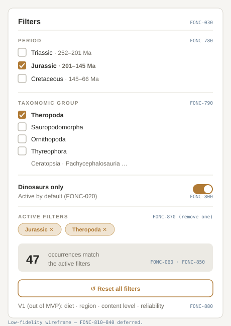

# Screen: Filters Panel

> Mockup page. Status: **Drafted (low-fi wireframe)**. Convention: see
> [README](README.md).

The panel for narrowing visible occurrences. MVP filters are period, taxonomic
group, and dinosaurs-only, with a live result count and clear ways to remove
filters.

## Related requirements

FONC-780, FONC-790, FONC-800, FONC-850, FONC-860, FONC-870, FONC-880, FONC-080,
FONC-060, PERF-230, PERF-320.

## Expected contents

- **Period filter** — filter occurrences by geological period (Triassic, Jurassic,
  Cretaceous) (FONC-780).
- **Taxonomic group filter** — filter by taxonomic group (FONC-790).
- **Dinosaurs-only filter** — restrict to non-avian dinosaurs (FONC-800); active by
  default (FONC-020).
- **Result count** — number of results matching active filters (FONC-850,
  FONC-060).
- **Individual filter removal** — remove any single active filter (FONC-870).
- **Reset filters** — clear all active filters in one action (FONC-880, FONC-080).
- **Empty-result affordance** — when filters match nothing, surface the empty state
  and a reset path (FONC-860, PERF-320).

## Notes

- Filters must be operable with a keyboard (PERF-230).
- Active filters must persist across navigation and load failures (FONC-1020,
  FONC-1340).
- V1 filters (diet, region, content level, reliability — FONC-810…FONC-840) are
  out of MVP; reserve space but do not build them now.

## States to document

- **No filters** — default (dinosaurs-only active).
- **Filters active / has results** — chips/removable filters + count.
- **Filters active / no results** — empty state; see
  [empty & error states](empty-error-states.md).

## TODO

- [x] Low-fi wireframe added: `../assets/mockups/filters-panel.svg`.
- [x] Show removable filter chips and the reset control (in the wireframe).
- [x] Annotate regions with requirement IDs (in the wireframe).
