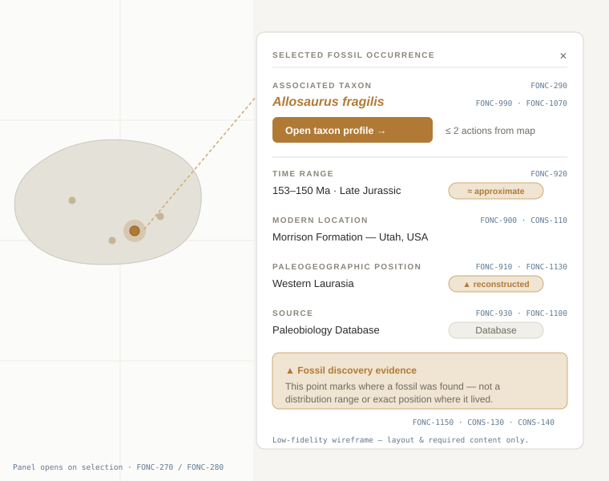

# Screen: Occurrence Panel

> Mockup page. Status: **High-fidelity mockup**. Convention: see
> [README](README.md); visual system in [design-guidelines.md](design-guidelines.md).

The information panel shown when a fossil occurrence is selected on the map. It
summarizes the occurrence and links to the full taxon profile — while making
clear that an occurrence is discovery evidence, not a distribution range.

## Related requirements

FONC-270, FONC-280, FONC-290, FONC-890, FONC-900, FONC-910, FONC-920, FONC-930,
FONC-990, FONC-1070, FONC-1100, FONC-1140, FONC-1150, CONS-110,
CONS-130, CONS-140.

## Expected contents

- **Associated taxon** — the taxon the occurrence documents, with a link to open
  its profile (FONC-290, FONC-990).
- **Time range** — the occurrence's time range; marked approximate when applicable
  (FONC-920, FONC-1140).
- **Modern location** — present-day discovery location when available (FONC-900,
  CONS-110).
- **Paleogeographic position** — the reconstructed position, shown as its own
  labelled field distinct from the modern one (FONC-910, CONS-110). *(SPEC-021,
  2026-08-14: FONC-1130's "marked as reconstructed" cue is retired; the two
  fields remain separately labelled, which is what CONS-110 requires.)*
- **Source** — identifiable source for the occurrence (FONC-930, FONC-1100).
- **Link to taxon profile** — reachable in ≤2 total actions from the visible
  occurrence (FONC-990, FONC-1070).
- **Evidence disclaimer** — explicit indication that the occurrence is fossil
  evidence of discovery, **not** a complete distribution range or exact life
  position (FONC-1150, CONS-130, CONS-140).

## Notes

- Keep modern vs paleogeographic coordinates clearly distinguished (CONS-110).
- Uncertainty that changes interpretation must be visible here, not hidden behind
  a secondary interaction (CONS-490).

## States to document

- **Selected** — default populated panel for a selected occurrence.
- **Field-unavailable** — modern or paleo position missing → explicit "not
  available" label rather than blank (FONC-490, FONC-1120).

## TODO

- [x] High-fidelity mockup added: `../assets/mockups/occurrence-panel.svg`.
- [ ] Show the panel both as a map overlay and (if applicable) docked layout.
- [x] Annotate regions with requirement IDs (in the mockup).
