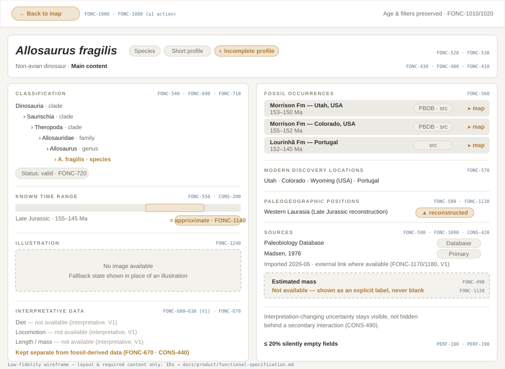

# Screen: Taxon Profile

> Mockup page. Status: **Drafted (low-fi wireframe)**. Convention: see
> [README](README.md).

The profile of a single taxon, reached from an occurrence or a search result.
Must present classification, time range, occurrences, and sources — and clearly
mark interpretative and missing data.

## Related requirements

FONC-510…FONC-590, FONC-670, FONC-430…FONC-450, FONC-480, FONC-490, FONC-690,
FONC-710, FONC-720, FONC-1000, FONC-1080, FONC-1120, FONC-1130, FONC-1140,
FONC-1240, PERF-160, PERF-170, PERF-180, PERF-190.

## Expected contents

- **Scientific name** — primary reference for the taxon (FONC-520, CONS-350).
- **Taxonomic rank** — e.g. clade, family, genus, species (FONC-530, FONC-710).
- **Classification** — available taxonomic hierarchy, levels distinguished
  (FONC-540, FONC-690); validity flags (invalid/doubtful/synonymous/uncertain)
  when known (FONC-720).
- **Time range** — known range with min/max boundaries; marked approximate when
  applicable (FONC-550, CONS-200, FONC-1140).
- **Fossil occurrences** — the known occurrences associated with the taxon
  (FONC-560).
- **Modern discovery locations** — present-day discovery sites (FONC-570).
- **Paleogeographic positions** — reconstructed positions, marked as reconstructed
  (FONC-580, FONC-1130).
- **Sources** — sources for the main information (FONC-590, FONC-1090).
- **Content level & interpretative markers** — content-level indicator (FONC-430);
  interpretative data marked distinct from fossil-derived data (FONC-670).
- **Missing-data labels** — unavailable fields shown with explicit labels, never
  blank (FONC-490, FONC-1120, PERF-180).
- **Return to map** — a single-action way back to the map, preserving state
  (FONC-1000, FONC-1080).

## States to document

- **Loading state** — when profile data is not already available (FONC-1270).
  Variant: `taxon-profile-loading.svg` (TODO).
- **Minimal-data state** — profile exists but is incomplete/minimal; explicit
  message (FONC-1300, FONC-480). Illustrated by the "Incomplete profile" flag and
  labeled missing field in the drafted wireframe; dedicated variant
  `taxon-profile-minimal.svg` (TODO).
- **Image fallback state** — no image available; show an alternative state
  (FONC-1240). Shown in the drafted wireframe (Illustration block); dedicated
  variant `taxon-profile-no-image.svg` (TODO).
- **Error state** — profile fails to load; clear error + retry, filters preserved
  (FONC-1320, FONC-1330, FONC-1340). See
  [empty & error states](empty-error-states.md).

## Notes

- Do not present interpretative fields (diet, mass, behavior — V1) as fact
  (CONS-280); keep sourced and assumed data separate (CONS-440).
- No profile may have more than 20% silently empty fields (PERF-190).

## TODO

- [x] Low-fi wireframe added: `../assets/mockups/taxon-profile.svg`.
- [ ] Add dedicated state-variant sheets (loading, minimal, no-image, error).
- [x] Show where V1 enrichment (diet, size, image, related taxa) will slot in.
- [x] Annotate regions with requirement IDs (in the wireframe).
