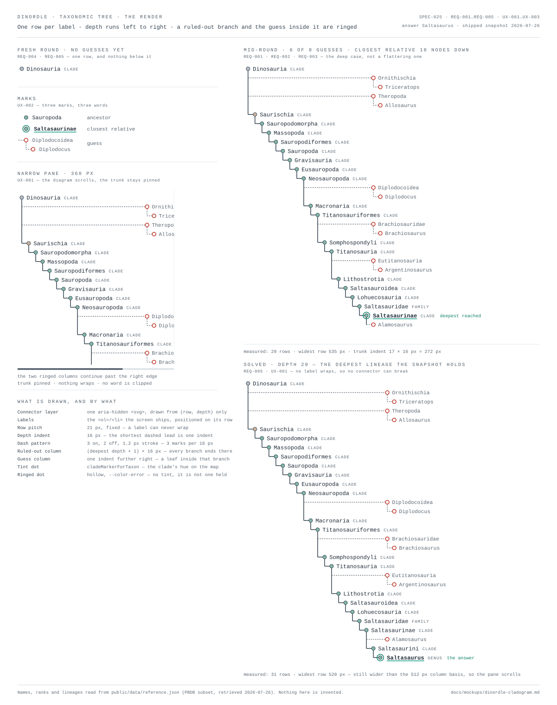

# SPEC-025: Dinordle taxonomic tree — a real horizontal cladogram, drawn from row and depth integers

## Summary

The Dinordle puzzle's revealed classification is drawn today as an indented
ordered list whose branch connectors are CSS pseudo-element elbows of a fixed
height. The elbows are sized in `rem`; the rows they connect are sized by their
content. As soon as a long clade name wraps, the elbow no longer reaches the row
above it and the diagram visibly comes apart — the owner's "wonky text"
(2026-08-14). This spec replaces that with a **real horizontal rectangular
cladogram**: the root at the left, depth increasing rightward, one label per row,
each ruled-out branch drawn as a ringed node in a shared column with the guess
that ruled it out hanging below it as a ringed leaf one indent further right, and
every connector drawn in one `aria-hidden` SVG layer whose geometry is computed
from two integers per label — its **row** and its **depth**. Because no label
shares a row, nothing has to wrap, so no connector can ever disagree with the
text it points at. The list in the DOM, its order, and its screen-reader
annotations are unchanged. A Playwright gate measures real bounding boxes at the
snapshot's deepest lineage (20 nodes) and fails if any two labels intersect,
reusing the mechanism SPEC-023 defines for the map.

## Context

The tree is the puzzle's whole subject: *"the tree is not a component on the
screen — it is the screen"* (`docs/mockups/daily-genus.md`). What it contains is
fixed by **SPEC-019 REQ-005** (the progressive revealed tree) and produced by
`revealedTree()` in `src/app/state/dailyGenus.ts:614`. That function returns a
`RevealedTree`:

- `trunk` — a **linear chain** of `TrunkNode`, root-first, from `Dinosauria` down
  to the deepest shared clade reached (or to the answer, on a win). It is linear
  by construction: it is `data.index.ancestors(deepest)`.
- each node carries `frontier` (the deepest node), `reachedBy` (the guess that
  first reached that depth), and `ruledOut` — the branches eliminated at that
  node, each labelled with the guess that killed it.
- `unresolved` — true while the descent below the frontier is unknown.

This is the fact that makes the redraw tractable and keeps it small: **there is no
general tree-layout problem here.** With a linear trunk, horizontal position is
depth and vertical position is a row counter; no balancing, no subtree
measurement, no layout library.

The current rendering is `DailyGenusScreen.tsx:515-596` plus
`dailyGenus.module.css:172-302`:

| Piece | Today |
| --- | --- |
| Structure | `<ol>` of `<li>`, each with `padding-left: calc(var(--depth) * 0.875rem)` |
| Trunk connector | `.node + .node .nodeRow::before` — a 0.875 × 0.85 rem box with a left and bottom border |
| Cut connector | `.cut::before` — a 12 × 0.75 rem box, same trick |
| Unresolved tail | `.unresolved::before` — a dashed 0.875 rem stub |
| Frontier | bold name, teal underline, thicker dot border |
| Clade identity | `.dot` filled with `cladeMarkerForTaxon(...).tint` |
| Screen readers | `visuallyHidden` spans: "— established ancestor, the deepest reached so far", "— ruled out by the guess X" |

Binding design context: `docs/mockups/design-guidelines.md` §4 (one teal accent,
meaning-only colour, clade tints reinforce but never carry identity alone), §6
(long labels wrap or truncate, **never overlap or clip**), §7 (all real states)
and `docs/mockups/anti-slop-checklist.md` "Do" 2 and 4 (draw the domain's own
object; a verdict is a mark on the object).

The mockup for this spec is
[`docs/mockups/dinordle-cladogram.md`](../../mockups/dinordle-cladogram.md).

**Owner review, 2026-08-14.** The owner reviewed that mockup and asked for
changes rather than approving it, so this Draft is edited in place (no
amendments — the spec is not Approved). Two changes, both carried through every
requirement below:

1. **The key is simplified to three entries**, worded `ancestor`, `closest
   relative`, `guess`. The fourth entry — the unresolved continuation, *"the
   descent continues, how far is not stated"* — is **removed**, and with its
   word gone the mark it defined goes with it (REQ-004). That mark is required by
   SPEC-019 REQ-005, so its removal is drafted as an amendment below.
2. **The eliminated-branch encoding drops the `✕` terminal and the
   strike-through.** A ruled-out branch is a dashed lead, a red ring on its node
   dot and its name in full; **and the guess that ruled it out is drawn the same
   way**, as a leaf inside that branch, instead of being appended to the branch's
   row as `◂ Guess` (REQ-003).

Naming: the puzzle is **Dinordle** (SPEC-022 owns that rename) and the heading
above this region is **Taxonomic tree** (SPEC-021 owns that copy). This spec uses
both names and specifies neither.



## Problem statement

1. **The connectors break.** An elbow is a fixed-height box positioned relative to
   a row whose height is content-driven. A wrapped name, or a row carrying a rank
   plus a "reached by" label at a narrow width, makes the row taller than the
   elbow, and the elbow then stops short of the node above it — a floating
   L-shape next to a name. Nothing detects this: no test in the repository
   measures a box.
2. **The diagram does not read as a tree.** At `0.875rem` (14 px) per level with
   no drawn horizontal segment, the result reads as an indented list with
   decorative corners rather than as a cladogram, which is the domain's own form
   for exactly this data.
3. **Ruled-out branches are weakly distinguished.** They differ from the trunk by
   size and grey alone plus a small `✕`; they sit at arbitrary horizontal
   positions, so eliminations cannot be scanned as a set.
4. **Depth is unbudgeted.** Lineages in the shipped snapshot reach **20 nodes**
   below `Dinosauria` (*Saltasaurus*, *Neuquensaurus*; 239 of the 2,123 genera
   under `Dinosauria` sit at depth 15 or deeper). Nothing in the current CSS
   states what happens when the diagram is wider than its column, so it wraps —
   which is the very thing that breaks the connectors.

## Goals

- Draw the revealed tree as a real horizontal rectangular cladogram that cannot
  come apart, at any depth the snapshot can produce.
- Make eliminated branches, and the guesses that eliminated them, unmistakable
  as leaves off the spine rather than as more spine.
- Bound the diagram's width by construction and state what happens when it still
  exceeds its pane.
- Keep the screen-reader experience exactly as good as it is today.
- Make the geometry machine-checked, reusing SPEC-023's gate mechanism rather
  than inventing a second one.

## Non-goals

- **Changing what the tree contains.** SPEC-019 REQ-005 and REQ-004 are
  untouched: no siblings, no depth count, no distance to the answer, no new
  taxon information. This is a rendering spec.
- **Changing the heading, the product name, the Ma column, the guess input, the
  track control or the reveal.** Those belong to SPEC-021, SPEC-022 and SPEC-024.
- **Animation or transitions** of any kind, including on redraw.
- **A general tree-layout engine.** The trunk is linear; anything that could lay
  out an arbitrary tree is out of scope.
- **Zoom, pan, collapse, or a mini-map.** The diagram is read, not navigated.
- **Introducing a charting or diagram library.** No new dependency.
- **A mobile layout for the Dinordle screen.** Only this region's width
  behaviour is specified.

## Users or actors

- **The player** mid-round, reading what is established and what is eliminated to
  decide the next guess.
- **A player using a screen reader or keyboard only**, for whom the list — not
  the drawing — is the interface.
- **CI**, which runs the unit tests in the `build` job and the geometry gate in
  the `e2e` job.

## Functional requirements

### REQ-001: A pure layout function assigns exactly one row to every label

- **Statement:** A DOM-free function — `layoutCladogram(tree: RevealedTree):
  CladogramLayout` in `src/app/state/cladogramLayout.ts` — converts a
  `RevealedTree` into an ordered list of **rows**. It walks the trunk root-first
  and emits, in order: the trunk node; then, for each branch ruled out at that
  node in the order `revealedTree` produced them, a `cut` row for the branch
  followed by a `guess` row for the guess that ruled it out — **except when
  `cut.name === cut.by`, where branch and guess are the same taxon and a single
  `cut` row stands for both**. No row is emitted for `tree.unresolved`. Each row
  carries `{ kind: "node" | "cut" | "guess", row, depth, … }` where `row` is its
  zero-based index in the emitted list and `depth` is the node's index in the
  trunk (a cut takes its parent's depth + 1; a guess takes its cut's depth + 1).
  The layout also carries `tipDepth = maxTrunkDepth + 1`, the column every `cut`
  row is drawn at, and `guessDepth = tipDepth + 1`, the column every `guess` row
  is drawn at. The function is total (an empty trunk yields an empty layout),
  pure, and allocates no DOM.
- **Rationale:** One label per row is the entire width and collision strategy.
  Two labels can only overlap if they share a row, so making that impossible by
  construction removes the failure mode rather than tuning around it, and it lets
  width grow with depth at the *indent* rate (16 px per level) instead of the
  *label* rate (~100 px per level). Keeping it a pure function means the geometry
  is unit-testable without a browser, in the style SPEC-019 already uses for the
  game's core.
- **Acceptance criteria:**
  1. For any `RevealedTree`, every emitted row has a unique `row` value and the
     values are consecutive from 0.
  2. The number of rows equals
     `trunk.length + Σ ruledOut.length + Σ (ruledOut where name !== by).length`.
     `tree.unresolved` contributes no row in either state.
  3. A trunk node's row precedes all of its own cut and guess rows, and all of
     them precede the next trunk node's row; every `guess` row is immediately
     preceded by the `cut` row it belongs to.
  4. `depth` of the *i*-th trunk node is *i*; a cut's depth is its parent's + 1;
     a guess's depth is its cut's + 1.
  5. `tipDepth` equals the last trunk node's depth + 1, and `guessDepth` equals
     `tipDepth + 1`.
  6. Identical input yields an identical layout (referentially stable ordering).
  7. Calling it with `{ trunk: [], unresolved: true }` returns an empty row list
     and does not throw.
  8. A `ruledOut` entry whose `name` equals its `by` yields exactly one row, of
     kind `cut`, and no `guess` row.
- **Verification method:** automated — Vitest, including a case built from the
  20-node *Saltasaurus* lineage in the shipped snapshot.
- **Evidence location:** `test/spec025-cladogram-layout.test.ts` (planned)

### REQ-002: Connectors are drawn in one aria-hidden SVG layer from those integers

- **Statement:** All branch geometry is drawn in a single inline `<svg>` element
  that is `aria-hidden="true"`, `focusable="false"`, contains **no text**, and is
  positioned behind the labels. Its coordinates are computed only from each row's
  `row` and `depth` and two module-scoped CSS custom properties — a row pitch and
  a depth indent — read as numbers by the component; no `getBoundingClientRect`,
  `ResizeObserver`, `MutationObserver`, canvas measurement or post-render
  correction is used. The drawing is: one **solid vertical bar** per trunk node
  from its own row down to its last child's row; a **solid horizontal lead** from
  that bar to the next trunk node; a **dashed horizontal lead** from that bar out
  to the ruled-out column for each `cut` row; and, for each `guess` row, a
  **dashed vertical drop** at the ruled-out column from its cut's row to its own,
  then a **dashed horizontal lead** out to the guess column. Nothing is drawn
  below the last row: there is no unresolved continuation (REQ-004). Every dashed
  stroke uses the same pattern — **3 px on, 2 px off, at a 1.2 px stroke width** —
  so the shortest lead the layout can produce still shows three dash marks (see
  the rationale). The CSS pseudo-element connectors `.nodeRow::before`,
  `.cut::before` and `.unresolved::before` are removed.
- **Rationale:** This is the defect's actual fix. Two coordinate systems — a
  connector measured in `rem` and a row measured by its content — can disagree;
  one system derived from integers cannot. Forbidding measurement also keeps the
  render synchronous and free of layout thrash, and keeps the connector layer out
  of the accessibility tree, where a decorative line has nothing to say.
  The dash pattern is specified rather than left to taste because dashed-vs-solid
  is the **non-colour** carrier of "ruled out" (REQ-003), so it has to survive the
  shortest lead the geometry can produce. That worst case is bounded and small: a
  cut hanging off the *last* trunk node has a lead of exactly one indent, 16 px,
  and a guess's vertical drop is one row pitch less two dot radii, ≈ 12.6 px.
  At 3-on/2-off that is three dash marks in 16 px and three in 12.6 px; the
  4-on/3-off pattern the first mockup used yields barely two in 16 px, which reads
  as a short solid line. Hence the pattern is a requirement, not a style.
- **Acceptance criteria:**
  1. The connector `<svg>` carries `aria-hidden="true"` and contains no `<text>`,
     `<title>` or `<desc>` element.
  2. `dailyGenus.module.css` contains no `::before` or `::after` rule that draws
     a border on a tree row (asserted against the stylesheet source).
  3. For a layout of *n* rows, the connector layer's height equals
     `n × row-pitch` (± 1 px) and every drawn vertical bar's x equals
     `depth × indent` (± 0.5 px).
  4. The component's render path contains no call to `getBoundingClientRect`,
     `ResizeObserver` or `MutationObserver` (asserted against the component
     source).
  5. Removing every label from the DOM leaves the connector geometry unchanged
     (it does not depend on text).
  6. Every dashed stroke in the layer declares `stroke-dasharray: 3 2` at
     `stroke-width: 1.2`, and no path is drawn below the last row's y.
- **Verification method:** automated — Vitest component + CSS-source tests (the
  source-assertion pattern SPEC-023 NFR-002 and `spec018-tokens.test.ts` already
  use), plus the geometry assertions in NFR-001.
- **Evidence location:** `test/ui/spec025-cladogram-render.test.tsx`,
  `test/ui/spec025-cladogram-css.test.ts` (planned)

### REQ-003: A ruled-out branch, and the guess inside it, read as ringed leaves off the spine

- **Statement:** Every branch ruled out is drawn with **all** of: a dashed lead
  leaving the trunk (the trunk's leads are solid); a **red ring on its node dot**,
  the dot itself unfilled — surface fill, ring stroke — because a ruled-out row
  carries **no clade tint**; its name **in full**, neither struck through nor
  abbreviated nor suffixed; and the existing `visuallyHidden` sentence "— ruled
  out by the guess X". **The guess that ruled it out is drawn identically** — same
  dashed lead, same red ring, name in full — on its own row immediately below,
  one indent further right, hanging off the ruled-out branch rather than off the
  trunk. **When the ruled-out branch *is* the guessed genus (`cut.name ===
  cut.by`) the two are one node and one row**, drawn once in the ruled-out column.
  All `cut` rows in one diagram share one x — the ruled-out column,
  `tipDepth × indent` — and all `guess` rows share the next, `guessDepth ×
  indent`, so the eliminations read as two columns. No ruled-out or guess row may
  carry the marks reserved for the trunk (a filled tint dot, a solid lead, the
  teal ring).
- **Rationale:** Owner revision, 2026-08-14: the `✕` terminal, the strike-through
  and the `◂ Guess` suffix are dropped in favour of a ring and the name in full.
  The change is not only cosmetic — it makes the diagram a **truer cladogram**.
  `evaluateGuess` sets the ruled-out branch to `ancestors(guess)[sharedAt + 1]`
  (`src/app/state/dailyGenus.ts:502-506`), so the guessed genus is by construction
  *inside* the branch it eliminated. Drawing it as a leaf under that branch states
  "this whole line, the one your guess lives on, is out" in the tree's own
  grammar, where the old suffix stated it in a label. It also makes the
  `cut.name === cut.by` case collapse with no special rule: there is one taxon
  there, so there is one node.

  **Carriers, and why this still is not colour-alone** (charter §4, PERF-250,
  SPEC-019 UX-001). Three remain and two of them are not colour: the **dashed**
  lead against the trunk's solid one, the **absent clade tint** (a hollow dot
  against a filled one), and the ring's hue. Verified at the real scale rather
  than asserted: at a 21 px row pitch and a 16 px indent the shortest dashed lead
  is one indent, 16 px, which at the 3-on/2-off pattern REQ-002 fixes shows three
  dash marks — legible, where a 4-on/3-off pattern would show two and read solid.
  The hollow-vs-filled dot is a 8.4 px disc either present or absent at 100%
  luminance difference, which needs no colour at all. In greyscale the row still
  reads: dashed lead, empty dot, and the hidden sentence still says "ruled out by
  the guess X".

  **Telling the branch from the guess.** They deliberately share one encoding, so
  the distinction is carried by **position in the descent**: the guess is always
  the deeper of the two — one indent right, in the guess column — and always the
  row immediately below its branch, joined to it by its own dashed drop. Scanning
  vertically, the ruled-out column lists eliminated clades and the column one
  indent right lists the guesses that eliminated them. This holds when one node
  carries several eliminations, which is the common case (67 % of real guesses
  land on `Dinosauria`): the rows interleave `cut, guess, cut, guess`, each pair
  adjacent and separately connected, so no guess can be read against another
  guess's branch. A collapsed `cut.name === cut.by` row has no drop below it and
  no guess row, which is what marks it as both at once.

  **Withholding the tint is preserved from the first draft** and is the strongest
  carrier: the tint means "a clade the player has established", and neither an
  eliminated branch nor a guess is one. Aligning the two columns is the
  cladogram's own convention and is what turns a scatter of names into sets that
  can be scanned.
- **Acceptance criteria:**
  1. Rendered at the mockup's six-guess scenario, every `cut` and `guess` row
     has: the full model string as its name with no strike-through
     (`text-decoration` is `none` on it), no `✕` character, a ringed dot, no
     element carrying the clade-tint custom property, and — for `cut` rows — the
     hidden "ruled out by the guess …" text.
  2. All `cut` rows share one x within 0.5 px; all `guess` rows share one x
     within 0.5 px; the guess x equals the cut x plus exactly one indent.
  3. A ruled-out entry whose `name === by` renders one row and the name exactly
     once, in the ruled-out column, with no `guess` row below it.
  4. Converting the rendered screen to plain text still distinguishes every
     ruled-out row from every trunk row (the words alone suffice).
  5. No `guess` row is rendered for a guess that produced no elimination (a
     correct guess, or a repeat inside an already-eliminated branch — the
     `seenBranch` dedupe in `revealedTree`).
- **Verification method:** automated — Vitest component test over a fixture
  round; the shared-x assertions in the e2e gate.
- **Evidence location:** `test/ui/spec025-cladogram-render.test.tsx`,
  `test/e2e/cladogram.e2e.ts` (planned)

### REQ-004: The deepest node keeps its marks; the unresolved continuation is removed

- **Statement:** The deepest established node is marked with a teal ring around
  its tint dot, its name set bold with a rule under it, and the visible words
  "deepest reached" — in addition to the existing `visuallyHidden` "— established
  ancestor, the deepest reached so far". Its `reachedBy` guess is named on that
  row unless one of the node's own eliminations already names that guess (shipped
  behaviour, preserved). **The unresolved continuation is removed**: whatever
  `tree.unresolved` holds, no dashed continuation, no `?`, no visible word
  "unresolved" and no hidden statement of it are rendered, and the diagram ends
  at its last row. The **key** under the diagram carries exactly three entries,
  always visible and never behind a disclosure, worded — verbatim — `ancestor`,
  `closest relative`, `guess`, each shown beside the mark it names; the `guess`
  entry shows the ruled-out branch and the guess inside it as the pair they are
  drawn as. On a win the answer's genus is the last trunk row.
- **Rationale:** Owner instruction, 2026-08-14: the key is cut to three entries
  and reworded to single terms, and the entry *"the descent continues — how far
  is not stated"* is removed rather than reworded. The mark it defined goes with
  it. The alternative — keeping a `?` on the diagram that the key no longer
  explains — would leave an undefined mark, which is worse than none and breaks
  the rule that every state is legible in shape **and** in words.

  **The consequence, stated plainly and not litigated.** That mark was an
  uncertainty disclosure. It said the descent carries on below the deepest node
  reached and that the tree is not claiming to know how far. Without it the
  diagram ends at the deepest established clade with nothing after it, which a
  player may read as "the lineage stops here" — it does not, and the tree no
  longer says so. This is a real loss against charter §2 (uncertainty is
  first-class, never hidden), it is the owner's decision, and it is recorded here,
  in the mockup page and in the SPEC-019 amendment below rather than absorbed
  silently. A fresh round is now a single row, `Dinosauria`, with nothing under
  it. The one partial mitigation, which is not a replacement: every dashed lead in
  the diagram already means "descends from — how far is not drawn", so un-stated
  descent still reads on eliminated branches, just no longer below the trunk.

  The rest of this requirement is unchanged from the first draft, on the original
  reasoning: the key is the one place a mark is defined in words, and a long
  sentence *on* the deepest row would make it the widest row in the diagram at
  every depth, forcing a scroll to read a caption.
- **Acceptance criteria:**
  1. Exactly one row carries the deepest-reached marks, and it is the last trunk
     row.
  2. With `unresolved: true` **and** with `unresolved: false`, no row of kind
     `unresolved` exists, no `?` is rendered in the region, and the region's text
     contains neither "unresolved" nor "the descent continues".
  3. The key renders exactly three entries with the words `ancestor`, `closest
     relative` and `guess`, always visible, not behind a disclosure.
  4. The `reachedBy` suppression case renders the guess name exactly once.
  5. A fresh round (one trunk node, no eliminations) renders exactly one row.
- **Verification method:** automated — Vitest component test across the fresh,
  mid-round, solved and lost states.
- **Evidence location:** `test/ui/spec025-cladogram-render.test.tsx` (planned)

### REQ-005: The rendered content is unchanged

- **Statement:** This change adds no taxon and no fact to the tree. The set of
  taxa named, the eliminations, their order, the rank shown per trunk node, the
  names, and the absence of siblings, depth counts and distance measures are
  exactly what `revealedTree()` produces today. `revealedTree()`, `TrunkNode` and
  `RevealedTree` are not modified. Two presentational consequences of the owner
  revision are in scope and are **not** content changes: (a) the guess that ruled
  out a branch moves from a suffix on that branch's row to its own row — the same
  string, already rendered today, in a different place, and it is a taxon a guess
  has touched by definition; (b) the unresolved continuation is removed (REQ-004),
  which removes a mark and a word, not a taxon — it never carried a name, id or
  silhouette.
- **Rationale:** SPEC-019 REQ-004/REQ-005/REQ-014 are approved and this spec is
  about drawing. A redraw is the classic opportunity to leak "how deep is the
  answer", which is the puzzle itself (`CLAUDE.md`: do not invent requirements).
  The guess-as-leaf placement is deliberately *schematic* — one indent, whatever
  the guess's real distance below the branch — precisely so that it states
  descent without stating depth.
- **Acceptance criteria:**
  1. `test/spec019-revealed-tree.test.ts` passes **unmodified**.
  2. No rendered text or attribute states a depth, a step count, a remaining
     distance, or a taxon no guess has touched.
  3. `git diff` touches no file under `src/app/state/dailyGenus.ts`.
  4. The set of taxon names rendered in the region is identical before and after
     the change, for the fresh, mid-round, solved and lost fixtures.
- **Verification method:** automated — the existing SPEC-019 suite plus a text
  assertion over the rendered screen; diff inspection at review.
- **Evidence location:** `test/spec019-revealed-tree.test.ts`,
  `test/ui/spec025-cladogram-render.test.tsx` (planned)

## Non-functional requirements

### NFR-001: Automated bounding-box non-overlap gate at the deepest real lineage

- **Statement:** A Playwright spec `test/e2e/cladogram.e2e.ts` runs in the
  existing `e2e` job and fails if any two labels in the diagram intersect. It
  enumerates boxes rather than naming them, so a label added later is covered
  automatically. It reuses SPEC-023 NFR-001's mechanism verbatim — the same
  `disjoint()` helper shape and the same 0.5 px tolerance — rather than
  introducing a second geometry harness:

  ```ts
  // Boxes under test, per viewport:
  //   labels: page.locator("[data-tree-row] [data-tree-label]")
  //   region: page.locator("[data-tree]")
  const overlap = (a: Box, b: Box) => ({
    w: Math.min(a.x + a.width,  b.x + b.width)  - Math.max(a.x, b.x),
    h: Math.min(a.y + a.height, b.y + b.height) - Math.max(a.y, b.y),
  });
  const disjoint = (a: Box, b: Box) => {
    const o = overlap(a, b);
    return o.w <= 0.5 || o.h <= 0.5;
  };
  ```

  **Determinism.** The daily answer is a pure function of the UTC date, so the
  test pins the clock (`page.clock.setFixedTime`) to **2026-12-11**, whose answer
  in the shipped snapshot is *Saltasaurus* — the deepest lineage available, 20
  nodes below `Dinosauria`. It then plays the six guesses of the mockup
  (*Triceratops*, *Allosaurus*, *Diplodocus*, *Brachiosaurus*, *Argentinosaurus*,
  *Alamosaurus*) through the guess input, producing a 29-row diagram — six
  eliminations, five of which also render the guess inside them, one collapsed
  because `cut.name === cut.by` — and finally plays *Saltasaurus* for the solved
  31-row case.
  **Viewport matrix:** 1440×900, 1280×800, 1024×768, 900×700, 820×640.
  Assertions at each viewport, in this order so the failure names the most
  specific cause: (1) every label box is inside the tree region's box, or the
  region scrolls horizontally and the label is inside its scroll extent;
  (2) every ordered pair of label boxes is disjoint; (3) every label's box height
  is at most the row pitch (nothing wrapped); (4) all `cut` rows share one x and
  all `guess` rows share one x, one indent to its right;
  (5) `elementFromPoint` at each label's centre resolves inside that label.
  Failures must name both labels and print both boxes.
- **Rationale:** This is the requirement that keeps the defect fixed. jsdom has no
  layout, so no unit test can see an overlap; "looks better" cannot be gated at
  all. Measuring boxes in a real browser at the worst case the data can produce is
  the cheapest assertion that proves the property. Screenshot comparison is
  rejected for the same reason SPEC-023 rejects it: it gates on paint, not
  geometry, and is unstable headless.
- **Acceptance criteria:**
  1. `pnpm run e2e` runs the spec and it passes on the implemented build.
  2. Reverting the layout change (restoring the CSS elbows) makes it fail with a
     message naming two overlapping labels. Demonstrated once during
     implementation and recorded in the PR.
  3. It adds no new CI job and no browser download.
  4. It stays inside the existing 30 s per-test timeout: one page per viewport,
     guesses replayed in place.
- **Verification method:** automated — the spec itself, in the `e2e` job.
- **Evidence location:** `test/e2e/cladogram.e2e.ts`, CI `e2e` job log (planned)

### NFR-002: The layout is regression-guarded without a browser

- **Statement:** Vitest covers the layout function (REQ-001) and the rendered
  structure (REQ-002/003/004) in jsdom: row uniqueness and ordering over a
  generated set of trees with trunk depths 1…20 and 0…8 eliminations per node,
  the `data-tree-row` / `data-tree-depth` / `data-tree-kind` attributes, the
  absence of pseudo-element connectors in the stylesheet, and the absence of
  measurement APIs in the component. These run in the fast `build` job.
- **Rationale:** The e2e gate is slow and needs a browser; the property that
  actually prevents the defect — one label per row — is arithmetic and can be
  checked in milliseconds. It also covers depths the e2e case cannot reach in one
  round.
- **Acceptance criteria:**
  1. A deliberate mutation that puts two labels on one row fails the unit test.
  2. `pnpm test` passes with no new dependency.
- **Verification method:** automated — Vitest.
- **Evidence location:** `test/spec025-cladogram-layout.test.ts`,
  `test/ui/spec025-cladogram-render.test.tsx`,
  `test/ui/spec025-cladogram-css.test.ts` (planned)

### NFR-003: Rendering stays synchronous and allocation-bounded

- **Statement:** The diagram renders in one pass with no measurement, no
  observers, no `requestAnimationFrame`, and no animation; a redraw after a guess
  produces at most `trunk.length + 2 × eliminations` rows — an elimination costs
  two rows, the branch and the guess inside it, or one where they are the same
  taxon, and the removed unresolved continuation costs none (≤ 36 for the deepest
  lineage with a full guess budget) — and one `<svg>` with at most that many path
  commands. `prefers-reduced-motion` needs no special case because nothing moves.
- **Rationale:** The screen re-renders on every keystroke of the guess input; a
  measuring layout would run per keystroke. The bound is stated so a later
  "improvement" that measures is visibly a change to this spec.
- **Acceptance criteria:**
  1. The component source contains no measurement or observer API (shared with
     REQ-002 criterion 4) and no `transition` / `animation` declaration exists on
     a tree element in the stylesheet.
  2. The rendered diagram for the 20-node case contains exactly one `<svg>`.
  3. The deepest real case measured — 20 trunk nodes, six eliminations, five of
     them carrying a guess — is 31 rows, inside the bound.
- **Verification method:** automated — component and CSS-source assertions.
- **Evidence location:** `test/ui/spec025-cladogram-css.test.ts` (planned)

## Security and privacy considerations

None. This spec changes rendering, CSS and tests only: no new data, no network
call, no storage, no user input. The screen's no-egress property (SPEC-019
SEC-001, `test/ui/spec019-no-egress.test.tsx`) is untouched and that test must
pass unmodified. No SEC-XXX requirement.

## Data model impact

None. `RevealedTree`, `TrunkNode` and `revealedTree()` are unchanged (REQ-005).
`CladogramLayout` is a derived view type, computed on render and never persisted,
never serialised, and never part of the stored round. No DATA-XXX requirement.

## API impact

No external interface. Internally: one new module
`src/app/state/cladogramLayout.ts` exporting `layoutCladogram` and its types, and
new stable test hooks in the markup — `data-tree` on the scroll region,
`data-tree-row="<index>"`, `data-tree-depth="<n>"`,
`data-tree-kind="node|cut|guess"` on each row, and `data-tree-label` on the
label element. No API-XXX requirement; the hooks exist because CSS-module class
names are hashed at build time and are not stable selectors (the precedent is
SPEC-023 REQ-001).

## UI or UX impact

### UX-001: No label wraps; the region scrolls instead, with the trunk pinned

- **Statement:** A label in the diagram is set on one line (`white-space: nowrap`)
  and is never truncated, abbreviated, rotated or ellipsised. The diagram sits in
  a horizontally scrollable region whose left edge is the trunk's origin, so the
  spine and the established names remain visible while the ruled-out and guess
  columns scroll into view. The region is keyboard-scrollable and reachable by keyboard, carries an
  accessible name, and shows a visible focus indicator. Vertical scrolling of the
  region is not introduced — the page scrolls, as it does today.
- **Rationale:** Wrapping is what broke the connectors, and truncation loses a
  word from a scientific name, which charter §6 forbids. Scrolling inside the
  element's own box is the pattern SPEC-023 REQ-004 already establishes for an
  oversized overlay. Pinning the left edge matters because the trunk carries the
  established classification — the part a player re-reads — while the right-hand
  columns carry eliminations they have already seen. Measured on the shipped
  snapshot after the owner revision: the deepest mid-round diagram is 535 px and
  the deepest solved diagram 520 px, both against a 512 px column basis, so this
  path is exercised in real play, not hypothetically — though by a narrower
  margin than the first draft's 536/558 px, because moving the guess off the cut
  row shortened the widest row.
- **Acceptance criteria:**
  1. No label's rendered box is taller than the row pitch at any viewport in the
     NFR-001 matrix (this is the "nothing wrapped" assertion).
  2. No rendered label text differs from the model's string (no ellipsis, no
     abbreviation).
  3. At 360 px of available width with the 20-node lineage, the region scrolls
     horizontally, the page body does not, and the trunk's dots stay at the
     region's left edge at scroll offset 0.
  4. The region is focusable, is scrollable with the arrow keys, has an
     accessible name, and shows a focus indicator.
- **Verification method:** automated — e2e geometry and keyboard assertions;
  Vitest for the accessible name.
- **Evidence location:** `test/e2e/cladogram.e2e.ts`,
  `test/ui/spec025-cladogram-render.test.tsx` (planned)

### UX-002: The screen-reader and keyboard experience is not made worse

- **Statement:** The accessible structure is unchanged: an ordered list of trunk
  nodes in root-first order, each with a nested list of the branches ruled out at
  it, carrying the same `visuallyHidden` sentences the screen ships today ("—
  established ancestor", "— established ancestor, the deepest reached so far", "—
  ruled out by the guess X"). The guess that ruled out a branch becomes a nested
  item under that branch, carrying its own hidden sentence, so the two facts a
  sighted player reads on two rows are the two a screen-reader player hears. The
  unresolved continuation and its hidden statement are removed for everyone at
  once (REQ-004): the disclosure is not quietly retained for assistive technology
  after being dropped from the drawing.
  Positioning is presentational only: rows may be positioned by CSS, but DOM order
  must equal reading order, and no content may move into the SVG layer. The axe
  gate stays green with no new serious or critical violation, and text keeps WCAG
  2 AA contrast.
- **Rationale:** SPEC-019 UX-003 requires tree nodes to carry accessible names
  describing their state, and this redraw must not trade that for a picture. The
  assumed approach — an SVG spine with positioned HTML labels over a semantic list
  — was evaluated and is adopted with one correction: the labels are not
  *positioned over* a separate list, they **are** the list; the SVG only draws
  lines. That removes any risk of the two going out of order.
- **Acceptance criteria:**
  1. The rendered accessible tree (roles, names, order) is equivalent before and
     after, asserted by a test that reads the list structure and the hidden
     annotations.
  2. `test/e2e/a11y.e2e.ts` passes with no new violation on the Dinordle screen.
  3. Every interactive element in the region has a target of at least 24 × 24 CSS
     px (only the scroll region qualifies today).
  4. No text lives inside the connector `<svg>`.
- **Verification method:** automated — Vitest structure assertions plus the
  existing axe e2e gate.
- **Evidence location:** `test/ui/spec025-cladogram-render.test.tsx`,
  `test/e2e/a11y.e2e.ts` (planned)

### UX-003: Charter compliance — the clade tint keeps its job, and colour keeps its meaning

- **Statement:** Trunk nodes keep the `cladeMarkerForTaxon` tint dot, the same hue
  the clade carries on the map and in the taxonomy fan (charter §4, SPEC-015,
  SPEC-017 AMEND-001); the name always carries identity first and the tint only
  reinforces. Teal remains the single accent and appears only on the
  deepest-reached node's ring and rule. The ruled-out ring uses a **new
  ruled-out status token**, authorised by the owner on 2026-08-14 ("Authorize a
  new one") as a hue distinct from and additional to the one SPEC-024 spent on
  its overlap verdict. It is named for its meaning (e.g. `--color-ruled-out`) and
  declared in the "Provenance / status cues" block of `tokens.css` beside
  `--color-attention` and `--color-error`. `--color-error` keeps its existing
  "load failure only" scope in both `tokens.css` and the charter §4 status table;
  this spec does not broaden it. Teal remains the single accent. The new token
  must clear 3:1 against `--color-surface` and `--color-ground` (the reference
  point, `#c0392b`, measures 5.4:1 and 4.4:1), and must stay distinguishable from
  `--color-error` itself, since a load-failure state can appear on the same
  screen and both are likely to be red-family. Because ruled-out
  rows carry no clade tint, the red ring never encircles a tint and never has to
  be read against one. No new border radius, no shadow, no gradient,
  no container, card, chip or icon set is introduced; every colour used comes from
  `src/app/styles/tokens.css`. At most **two module-scoped custom properties** may
  be added (the row pitch and the depth indent), declared in
  `dailyGenus.module.css` with a comment; they are local values, not new global
  tokens.
- **Rationale:** The anti-slop checklist's most expensive failure is at the layout
  level, and a redraw is exactly where a "diagram design system" gets invented.
  The clade tint is also the one cross-screen code this product has, so a redraw
  that dropped it would cost more than it gained.
- **Acceptance criteria:**
  1. Apart from the single authorised ruled-out token, the diff introduces no
     new hex literal, `border-radius`, `box-shadow` or font-family.
  2. Every trunk row renders a tint dot whose value equals
     `cladeMarkerForTaxon(node.id, …).tint`; no cut or guess row renders one.
  3. Teal appears only on the deepest-reached node's marks within this region,
     and red only on ruled-out and guess rings.
  4. The red used is exactly `var(--color-ruled-out)` (the new token, whatever
     its final name); `--color-error` is unchanged in value and in stated scope;
     exactly one token is added to `tokens.css`; and the ring is never drawn over
     a clade tint.
  5. At most two new custom properties, both scoped to the module.
- **Verification method:** automated — Vitest tint assertion and a CSS-source
  scan; plus diff inspection against the charter at review.
- **Evidence location:** `test/ui/spec025-cladogram-render.test.tsx`,
  `test/ui/spec025-cladogram-css.test.ts` (planned)

## Configuration impact

None. No environment variable, feature flag, build setting or dependency. The row
pitch and depth indent are module-scoped CSS custom properties, not configuration.

## Error handling

- **Empty trunk** (`rootId` missing, so `revealedTree` returns `{ trunk: [],
  unresolved: true }`): the layout is empty and the region renders nothing — the
  unresolved statement it used to fall back to no longer exists (REQ-004). No
  empty `<svg>`, no stray border, no blank box (REQ-001 criterion 7). **Open
  consequence:** the region is then silent where it used to say something; the
  screen's own empty and error states (SPEC-019) are unaffected and still speak.
- **A node with no eliminations and no child** (the deepest node reached,
  mid-round): its bar has no children to reach, so no bar is drawn from it, and
  nothing follows it — the diagram simply ends.
- **Clade tint unavailable** (`cladeMarkerForTaxon` falls back): the neutral
  `#b4bcc6` is used, as today; identity still rests on the name.
- **SVG unsupported / stylesheet failed to load**: the list still renders in DOM
  order with its hidden annotations, so the region degrades to a readable indented
  list rather than to nothing. The connector layer is decorative by construction.

## Edge cases

- **Depth 1** — a fresh round: one trunk row plus the tail; no bar, no cut.
- **Depth 20** — *Saltasaurus* / *Neuquensaurus*, the snapshot's deepest: 31 rows
  when solved, 520 px wide, so the region scrolls at the 512 px column basis.
- **Eight eliminations on one node** — the whole guess budget spent inside
  `Dinosauria` (67 % of real guesses land there): up to sixteen consecutive rows
  under the root, alternating branch and guess, the branches all in the ruled-out
  column and the guesses all one indent to its right. This is the case that
  stresses "which one is my guess"; REQ-003 answers it by adjacency and column.
- **A ruled-out branch that is the guessed genus** (`cut.name === cut.by`, e.g.
  *Alamosaurus* against *Saltasaurus*): the name prints once (REQ-003).
- **The deepest node's `reachedBy` equals one of its own eliminations' `by`**: the
  "reached by" label is suppressed; shipped behaviour, preserved (REQ-004).
- **A win** — the trunk runs to the genus and the genus row is both the deepest
  node reached and the answer.
- **A repeat guess inside an already-eliminated branch** — `revealedTree`'s
  `seenBranch` dedupe keeps one elimination, attributed to the *first* guess that
  hit that branch, so the second guess gets no row of its own. Unchanged by this
  spec, and stated because the new encoding makes it look like every guess should
  produce a leaf: it does not, and never did (REQ-003 criterion 5).
- **Both right-hand columns move** when a guess deepens the descent, shifting the
  ruled-out and guess labels right between turns. Accepted: it is a redraw
  between guesses, and the alternative — placing each label beside its own branch
  point — loses the scannable elimination columns.
- **A very long clade name** (`Eoenantiornithiformes`, 21 characters) at depth
  20: the widest single row, and the case the scroll region exists for.

## Acceptance criteria

This spec is satisfied when all of the following hold:

1. The tree renders as a horizontal rectangular cladogram with one label per row,
   connectors drawn from `(row, depth)` integers in an `aria-hidden` SVG layer,
   and no CSS pseudo-element elbows remain (REQ-001, REQ-002).
2. Ruled-out branches are dashed, red-ringed, named in full, carry no tint dot
   and share one column; the guess that ruled each one out is drawn the same way
   one indent right, except where branch and guess are one taxon (REQ-003).
3. The deepest node reached keeps its marks and its words, the key carries the
   three owner-worded entries, no unresolved continuation is rendered (REQ-004),
   and no taxon or fact was added to or removed from the tree (REQ-005).
4. `pnpm run e2e` includes the non-overlap gate at the 20-node lineage across the
   five-viewport matrix and passes; it demonstrably fails when the change is
   reverted (NFR-001).
5. Nothing wraps, nothing is truncated, and the region scrolls with the trunk
   pinned (UX-001).
6. The accessible list and its order are unchanged apart from the guess's own
   nested item and the removed unresolved statement, its hidden annotations are
   otherwise unchanged, and axe stays green (UX-002).
7. The clade tint, the single teal accent and the token palette are intact, the
   ruled-out red comes from an existing token, and at most two module-scoped
   custom properties are added (UX-003).
8. `pnpm run typecheck`, `pnpm run lint`, `pnpm run format`, `pnpm test`,
   `pnpm run build` and the governance scripts all pass.
9. `docs/mockups/screens-index.md` lists the new mockup page, and **both**
   SPEC-019 amendments in *Required amendments* — AMEND-004 (the redraw) and
   AMEND-005 (the unresolved continuation removed) — have been transplanted.

## Verification matrix

| Requirement ID | Acceptance criterion | Verification method | Test / command / manual check | Evidence location | PR reference |
| -------------- | -------------------- | ------------------- | ----------------------------- | ----------------- | ------------ |
| REQ-001 | Rows unique and consecutive; counts and depths correct; pure and total | automated | `pnpm test spec025-cladogram-layout` | `test/spec025-cladogram-layout.test.ts` | TBD |
| REQ-002 | SVG layer aria-hidden, textless; no pseudo-element elbows; geometry from integers; dash pattern 3/2 at 1.2 px; nothing drawn below the last row; no measurement APIs | automated | `pnpm test spec025-cladogram-render spec025-cladogram-css` | `test/ui/spec025-cladogram-render.test.tsx`, `test/ui/spec025-cladogram-css.test.ts` | TBD |
| REQ-003 | Cut and guess rows dashed, red-ringed, name in full, no strike-through, no tint dot; two shared columns one indent apart; `name === by` collapses to one row; no row for a deduped repeat guess | automated | `pnpm test spec025-cladogram-render`; `pnpm run e2e` | `test/ui/spec025-cladogram-render.test.tsx`, `test/e2e/cladogram.e2e.ts` | TBD |
| REQ-004 | One deepest-reached row with teal ring, rule and words; no unresolved continuation in any state; key names three marks with the owner's words; fresh round is one row | automated | `pnpm test spec025-cladogram-render` | `test/ui/spec025-cladogram-render.test.tsx` | TBD |
| REQ-005 | SPEC-019 tree test unmodified; no depth or distance rendered; reducer untouched; identical taxon-name set before and after | automated + inspection | `pnpm test spec019-revealed-tree`; diff review | `test/spec019-revealed-tree.test.ts` | TBD |
| NFR-001 | No two label boxes intersect at 5 viewports on the 20-node lineage; fails on revert | automated | `pnpm run e2e` | `test/e2e/cladogram.e2e.ts`, CI `e2e` log | TBD |
| NFR-002 | Row-uniqueness holds for depths 1…20 with 0…8 cuts per node; mutation fails the test | automated | `pnpm test` | `test/spec025-cladogram-layout.test.ts` | TBD |
| NFR-003 | One `<svg>`, no observers, no animation | automated | `pnpm test spec025-cladogram-css` | `test/ui/spec025-cladogram-css.test.ts` | TBD |
| UX-001 | No label taller than the row pitch; no truncation; scrolls at 360 px with trunk pinned; keyboard-scrollable | automated | `pnpm run e2e` | `test/e2e/cladogram.e2e.ts` | TBD |
| UX-002 | List roles, order and hidden annotations unchanged; axe green; no text in the SVG | automated | `pnpm test spec025-cladogram-render`; `pnpm run e2e` | `test/ui/spec025-cladogram-render.test.tsx`, `test/e2e/a11y.e2e.ts` | TBD |
| UX-003 | Tint dot on trunk rows only and equal to `cladeMarkerForTaxon`; teal only on the deepest-reached marks; red only from `--color-error`; no new hex; ≤2 module custom properties | automated + inspection | `pnpm test spec025-cladogram-render spec025-cladogram-css`; diff review | `test/ui/spec025-cladogram-render.test.tsx`, `test/ui/spec025-cladogram-css.test.ts` | TBD |

## Test plan

**New — `test/spec025-cladogram-layout.test.ts` (REQ-001, NFR-002).** Pure
Vitest, no DOM. Cases: empty trunk; depth 1 fresh round; the mockup's six-guess
*Saltasaurus* round built from `test/spec019-fixture.ts` and the shipped
`reference.json`; and a generated sweep over trunk depths 1…20 with 0…8
eliminations per node asserting row uniqueness, consecutiveness, ordering,
depths and `tipDepth`.

**New — `test/ui/spec025-cladogram-render.test.tsx` (REQ-002/003/004/005,
UX-002/003).** Renders the Dinordle screen through the existing
`test/ui/spec019-harness.tsx` fixture and asserts markup: the `data-tree-*`
hooks, one aria-hidden textless `<svg>`, the ruled-out row's carriers, the tint
dot on trunk rows and its absence on cut and guess rows, the deepest-reached
marks, the absence of any unresolved continuation in every state, the three key
entries and their words, the `cut.name === cut.by` collapse, the `reachedBy`
suppression case, and the list structure and hidden annotations.

**New — `test/ui/spec025-cladogram-css.test.ts` (REQ-002, NFR-003, UX-003).**
Reads `src/app/components/dailyGenus.module.css` and `DailyGenusScreen.tsx` as
text — the pattern `spec018-tokens.test.ts` and SPEC-023 NFR-002 already use —
and asserts: no `::before`/`::after` border rule on a tree row, no new hex
literal, no `transition`/`animation` on a tree element, at most two new custom
properties, and no measurement or observer API in the component.

**New — `test/e2e/cladogram.e2e.ts` (NFR-001, UX-001).** Chromium under the
existing Playwright config. Pins the clock to 2026-12-11 (answer *Saltasaurus*),
opens `#daily`, plays the six guesses, and measures at 1440×900, 1280×800,
1024×768, 900×700 and 820×640: containment, pairwise disjointness, label height
≤ row pitch, shared tip-column x, and `elementFromPoint`. Then plays
*Saltasaurus* and repeats on the 31-row solved diagram. One extra case at 820×640
asserts the region scrolls, the body does not, and the trunk is at the region's
left edge at scroll offset 0; one keyboard case asserts the region is focusable
and arrow-scrollable.

**Existing suites that must stay green, unmodified where stated:**
`test/spec019-revealed-tree.test.ts` (**unmodified** — the evidence that the
model did not change), `test/spec019-guess-evaluation.test.ts`,
`test/spec019-persistence.test.ts`, `test/ui/spec019-no-egress.test.tsx`,
`test/ui/spec019-practice.test.tsx`, `test/ui/spec019-rollover.test.tsx`,
`test/ui/spec020-*`, `test/e2e/spec019-daily.e2e.ts`, `test/e2e/a11y.e2e.ts`.

**Existing suites expected to need edits:**
`test/ui/spec019-daily-screen.test.tsx` — its REQ-004/REQ-005 tests select the
frontier by hashed class name (`container.querySelector('[class*="frontier"]')`,
line 99) and assert row text; they move to the `data-tree-*` hooks, keeping every
assertion about *content* byte-identical.
`test/ui/spec019-states.test.tsx` — renders the fresh, solved and lost trees;
selectors only.
Neither test's expectations about what the tree contains may be weakened, and no
test may be skipped or deleted (`CLAUDE.md`).

**Fixtures:** none new. The unit tests build rounds from `test/spec019-fixture.ts`
and the e2e gate runs against the shipped snapshot through the existing preview
server.

**Manual check (supplementary, not the gate):** open the Dinordle screen at
1440×900 and at 820×640 on a deep round and confirm the diagram reads as a tree —
the automated gate proves non-overlap, not that the drawing is good.

## Rollback plan

The change is one new pure module, the render body of one component, one CSS
module, and four test files. There is no data, storage, API or migration surface,
so rollback is `git revert` of the single PR and the previous render returns
exactly. Partial rollback is also safe: keeping `layoutCladogram` while reverting
the SVG layer leaves an unused pure function, not a broken screen. If the e2e gate
proves flaky (it should not — it measures DOM boxes, not paint), the correct
response is to narrow the viewport matrix, never to skip or delete the assertions
(`CLAUDE.md`).

## Risks

- **The right-hand columns shift between guesses.** Accepted and recorded (Edge
  cases); the alternative loses the elimination columns. If the owner dislikes it, the
  fallback is per-branch placement, which changes REQ-003 criterion 2 only.
- **A very deep lineage still overflows a narrow pane.** True by arithmetic and
  handled by UX-001's scroll region rather than hidden; the gate asserts the
  scroll case rather than asserting it never happens.
- **The e2e clock pin depends on the snapshot.** If the snapshot is rebuilt, the
  pool changes and 2026-12-11 may no longer be *Saltasaurus*. Mitigated by the
  test asserting the answer's identity before measuring, so a snapshot change
  fails loudly with a clear message instead of silently measuring a shallow tree.
- **Selector churn in existing tests.** The `data-tree-*` hooks are introduced
  precisely so this is the last time; the edits are mechanical and no assertion
  about content changes.

## Open questions

- [x] Is a general tree layout needed? **Resolved:** no. `revealedTree()` returns
      a linear trunk (`ancestors(deepest)`), so x is depth and y is a row counter.
      Verified against `src/app/state/dailyGenus.ts:614-660`.
- [x] Should labels alternate above and below a single horizontal spine?
      **Resolved:** no. It halves a ~2,000 px requirement to ~1,000 px, still
      needs a scroll, makes the reading order a zigzag, and leaves no room for
      eliminated branches. One label per row bounds width by the indent rate
      instead. Recorded in the mockup page.
- [x] Rotated or abbreviated names to save width? **Resolved:** no — charter §6
      forbids losing a word, and rotation is unreadable at 12 px.
- [x] SVG plus positioned labels, or an all-SVG diagram? **Resolved:** SVG for
      lines only; the labels stay HTML and stay the list. An all-SVG diagram would
      move text out of the accessible list, which UX-002 forbids.
- [ ] Deferred to implementation: whether the row pitch and depth indent can be
      expressed with existing spacing tokens or need the two module-scoped custom
      properties UX-003 permits. Either outcome satisfies this spec.

## Human decisions required

- [x] **Confirm the shape.** The tree becomes a horizontal cladogram: root at the
      left, one name per row, depth stepping right by a small indent, ruled-out
      branches drawn as red-ringed nodes in a column at the right, each with the
      guess that ruled it out below it. See
      `docs/mockups/dinordle-cladogram.md`.
      Answer: **Confirmed.** Owner approval recorded in session, 2026-08-14 (nelsonjeanrenaud@gmail.com).
- [x] **Confirm the two columns.** Eliminated branches all sit at one x and the
      guesses inside them at one indent further right; both move right when a
      guess deepens the descent.
      Answer: **Confirmed.** Owner approval recorded in session, 2026-08-14 (nelsonjeanrenaud@gmail.com).
- [x] **Confirm the scroll.** At the snapshot's deepest lineage the diagram is
      520–535 px and a narrow pane scrolls horizontally rather than wrapping.
      Answer: **Confirmed.** Owner approval recorded in session, 2026-08-14 (nelsonjeanrenaud@gmail.com).
- [x] **Decide the red.** The ruled-out ring needs a red. `--color-error`
      (`#c0392b`) exists but is scoped by `tokens.css` and by charter §4 to
      **load failure only**, and a ruled-out branch is a verdict, not an error.
      Two options, and this spec does **not** pick one on the owner's behalf:
      **(a)** broaden `--color-error` to cover "load failure or ruled out" and
      update the charter's status table to say so — no new hue, which is what
      REQ-003 and UX-003 are written against and what the mockup draws; or
      **(b)** add a distinct ruled-out status token, which is a **new hue** and
      therefore needs an explicit authorisation of its own (the single new hue
      the owner authorised in SPEC-024 was for that spec's overlap verdict and is
      spent; it does not extend here).
      Answer: **(b) — authorise a distinct ruled-out status token.** Owner
      decision, 2026-08-14: "Authorize a new one". `--color-error` keeps its
      existing "load failure only" scope; a second status token is added for the
      ruled-out verdict. This is a **new hue**, authorised explicitly and
      separately from the one SPEC-024 spent on its overlap verdict.

      Consequences to carry into implementation: the token is named for its
      meaning (e.g. `--color-ruled-out`), sits in the "Provenance / status cues"
      block of `tokens.css` beside `--color-attention` and `--color-error`, and
      must clear contrast on the surface it is drawn on. It must also stay
      distinguishable from `--color-error` itself, since both may be red-family
      and an error state can appear on the same screen. REQ-003, UX-003 and the
      mockup are written against `#c0392b` and must be re-pointed at the new
      token; if the chosen hue differs visibly from what the mockup draws, the
      mockup is regenerated to match rather than left to drift.
- [x] **Confirm removing the unresolved continuation** — and with it the
      statement that the descent continues below the deepest node reached. This
      follows from cutting the fourth key entry (owner, 2026-08-14). It is
      required by SPEC-019 REQ-005, so it needs the AMEND-005 block below, and it
      is a real loss against charter §2 (REQ-004 records the consequence).
      Answer: **Confirmed — amend SPEC-019 REQ-005.** Owner decision,
      2026-08-14: "Yes ammend Req 005". The unresolved continuation is removed
      from the diagram and from the accessible state names, and AMEND-005 below
      is authorised. The consequence recorded in REQ-004 stands as written: the
      diagram now ends at the deepest established clade with nothing after it,
      and the disclosure is dropped for screen-reader users too rather than
      quietly kept for them.
- [x] **Confirm the SPEC-019 amendments below** — AMEND-004 (the redraw) and
      AMEND-005 (the unresolved continuation removed) — and their numbers, once
      the sibling specs land.
      Answer: **Confirmed.** Owner approval recorded in session, 2026-08-14 (nelsonjeanrenaud@gmail.com).
- [x] **Approval reference for Definition of Ready** (status → Approved).
      Answer: **Confirmed.** Owner approval recorded in session, 2026-08-14 (nelsonjeanrenaud@gmail.com).

**Approval record.** Owner approval recorded in session, 2026-08-14 (nelsonjeanrenaud@gmail.com). The owner confirmed the shape, the two columns, the scroll, both SPEC-019 amendments, and answered the two open decisions above.

## Conflict check

Affected components: `DailyGenusScreen`, `dailyGenus.module.css`, a new
`cladogramLayout` module, the Vitest UI suite, the Playwright suite.

- **SPEC-019 REQ-005 (the progressive revealed tree)** — governs what the tree
  *contains*. Two distinct interactions, so two amendment blocks below rather than
  one blurred one:
  - **How it is drawn.** Nothing REQ-005 requires about content changes
    (REQ-005 here). REQ-005 does call the tree "the game's primary surface", and
    the rendering it was written against was the indented list, so `AMEND-004` is
    recorded rather than left implicit. Drawing the guessed genus as a leaf inside
    the branch it ruled out stays inside REQ-005's own rule — "only nodes that a
    guess has touched" — because a guess has, by definition, touched itself.
  - **What it contains — a real removal.** REQ-005 requires "an unresolved
    continuation below the deepest confirmed ancestor", and one of its acceptance
    criteria names it explicitly ("other than the unresolved continuation, which
    carries no name, id, or silhouette"). SPEC-019 **UX-003** also lists
    `unresolved` among the states a tree node's accessible name must describe.
    The owner's key change removes that mark (REQ-004 here), so this is a
    behavioural change to an implemented spec and needs `AMEND-005` below and the
    owner's tick. **`conflicts_with` stays empty only because the amendment is
    drafted**; without it, SPEC-025 REQ-004 and SPEC-019 REQ-005 conflict.
- **SPEC-019 UX-001 (charter compliance)** — restated and tightened as UX-003.
  Not weakened.
- **SPEC-019 UX-003 (accessibility)** — restated as UX-002 and preserved exactly;
  no amendment needed.
- **SPEC-019 REQ-004 / REQ-014** — no depth, distance or out-of-subtree node is
  introduced (REQ-005 here). Untouched.
- **SPEC-021 (chrome and copy)** — owns the heading above this region
  ("Taxonomic tree") and its own SPEC-019 amendment. This spec neither changes nor
  depends on that copy; it only uses the name.
- **SPEC-022 (global app bar, the Dinordle rename)** — owns the product name and
  its own SPEC-019 amendment. No overlap in file scope beyond both eventually
  editing `DailyGenusScreen.tsx`; the regions differ (app bar and header vs. the
  tree body).
- **SPEC-024 (puzzle legibility)** — rewrites the Ma column and the track control
  on the same screen and explicitly records SPEC-025 as adjacent work whose
  subject (the tree's geometry) it does not touch. Symmetrically, this spec does
  not touch the Ma column, the header or the track control. Both may need to
  rebase on the other's diff; neither has a requirement dependency.
- **SPEC-023 (map overlay layout)** — different surface (the map), but this spec
  deliberately **reuses** its `disjoint()` non-overlap mechanism and 0.5 px
  tolerance rather than inventing a second geometry harness. If SPEC-023 lands
  first, the helper should be shared rather than copied; if it does not, this
  spec's copy stands alone. No requirement of SPEC-023 changes either way.
- **SPEC-015 / SPEC-017 AMEND-001 (clade tints)** — the tint's cross-screen role
  is preserved by UX-003, not altered.

No entry is required in `conflicts_with`.

## Required amendments to existing specs

> Ready to transplant. Do **not** apply this until this spec is approved and the
> owner has ticked the amendment box above; then paste the block into the target
> spec's `## Spec amendments` section, verbatim. **Do not edit SPEC-019 from this
> spec.**

### For SPEC-019 (`docs/specs/implemented/SPEC-019-daily-genus-puzzle.md`)

**Numbers chosen: `AMEND-004` and `AMEND-005`, and why.** SPEC-019's amendments
section holds only the empty template stub numbered `AMEND-001`. Three sibling
specs — **SPEC-021** (the snapshot date narrowed to the reveal), **SPEC-022** (the
Dinordle rename and the app-bar entry point) and **SPEC-024** (the time clue
becomes a per-guess overlap verdict) — each drafted a SPEC-019 amendment as
`AMEND-001`, written as if it were the first, and **all three are now Approved**.
Whichever lands first fills the stub as `AMEND-001` and the other two become
`AMEND-002` and `AMEND-003`, so the next free number is **`AMEND-004`**, which
this spec's redraw amendment takes, and the one after it, **`AMEND-005`**, which
this spec's removal amendment takes. Two blocks and not one because they are
different kinds of change and the first says explicitly that content is
unchanged: `AMEND-004` amends only how REQ-005's surface is drawn; `AMEND-005`
removes something REQ-005 requires. The numbers are landing-order dependent, not
a claim on slots: at transplant time take the next two free numbers in the file
and renumber these blocks if the siblings have not all landed.

```markdown
### AMEND-004 — the revealed tree is drawn as a horizontal cladogram; its contents are unchanged

- **Date:** 2026-08-14
- **Reason:** The owner reported the tree's rendering as defective — "would be
  better if the render of the tree was better it's wonky text here you think it's
  easy to make a real horizontal tree?" (2026-08-14). As built, the tree is an
  indented `<ol>` whose connectors are CSS pseudo-element elbows of a fixed `rem`
  height hung off rows whose height is content-driven, so a wrapped clade name
  leaves the elbow floating and the diagram visibly comes apart. SPEC-025
  replaces the rendering with a real horizontal rectangular cladogram whose
  connector geometry is computed from each label's row and depth.
- **Changed requirements:** **REQ-005** only, and only in how the surface is
  drawn — the unresolved continuation is handled separately, by AMEND-005. Its
  statement — the trunk from `Dinosauria` to the deepest shared clade, the
  ruled-out child branch per guess labelled with the guessed genus, only nodes a
  guess has touched, no node marked confirmed unless it is an ancestor of the
  answer — is **unchanged** by this block. What is added, by SPEC-025
  REQ-001…REQ-004 and UX-001, is a constraint on the rendering: the tree is drawn
  root-left with depth increasing rightward, exactly one label per row, branch
  connectors drawn in an `aria-hidden` SVG layer from row and depth integers,
  each ruled-out branch drawn as a ringed node in a shared column with the guess
  that ruled it out as a ringed leaf one indent further right, and no label
  wrapping — a diagram wider than its pane scrolls horizontally with the trunk
  pinned. The guessed genus appearing as its own node is **not** new content: it
  is the same string REQ-005 already requires the ruled-out branch to be
  "labelled with", moved from a suffix to a row, and it is a node a guess has
  touched by definition, so REQ-005's no-siblings rule is not weakened.
  **UX-003 is preserved** except as amended by AMEND-005: the accessible
  structure stays an ordered list in root-first order with the same
  `visuallyHidden` state sentences, plus a nested item for the guess carrying its
  own sentence, and nothing moves into the SVG. **UX-001 is unchanged**: the clade
  tint keeps its cross-screen role, teal stays the only accent for the
  deepest-reached marks, and every state stays legible in shape and in words.
  **REQ-004 and REQ-014 are unchanged**: no depth, distance or out-of-subtree node
  is rendered — the guess leaf is placed one schematic indent below its branch and
  never states the real distance.
- **Behavioral impact:** Visual only, plus a scroll affordance. The set of taxa
  named, their order, their words, the deepest-reached and elimination marks and
  the hidden annotations are all identical; `revealedTree()`, `TrunkNode` and
  `RevealedTree` are not modified. Nothing about selection, guess evaluation, the
  time clue, the hint, the budget, storage or the shared summary changes. The one
  new user-visible behaviour is that at a very deep lineage in a narrow pane the
  diagram scrolls sideways instead of wrapping.
- **Test impact:** `test/spec019-revealed-tree.test.ts` must pass
  **unmodified** — that is the evidence the model did not change. Selector-only
  edits in `test/ui/spec019-daily-screen.test.tsx` (its deepest-node lookup uses
  the hashed class name `[class*="frontier"]`, replaced by the `data-tree-*`
  hooks) and `test/ui/spec019-states.test.tsx`; no assertion about content is
  weakened.
  New: `test/spec025-cladogram-layout.test.ts`,
  `test/ui/spec025-cladogram-render.test.tsx`,
  `test/ui/spec025-cladogram-css.test.ts` and the geometry gate
  `test/e2e/cladogram.e2e.ts`. `test/e2e/a11y.e2e.ts` and
  `test/ui/spec019-no-egress.test.tsx` pass unmodified. No test is skipped or
  deleted.
- **Human approval reference:** Owner approval in session, 2026-08-14
```

```markdown
### AMEND-005 — the unresolved continuation is removed from the revealed tree

- **Date:** 2026-08-14
- **Reason:** Reviewing the SPEC-025 mockup, the owner simplified the tree's key
  to three entries and removed the fourth outright: *"the descent continues — how
  far is not stated → nothing"* (2026-08-14). The key is the only place a mark is
  defined in words, so a mark whose entry is gone has no word left; keeping the
  drawn `?` would leave an undefined mark on the diagram, which is worse than
  removing it. SPEC-025 REQ-004 therefore removes the mark itself.
- **Changed requirements:** **REQ-005** and **UX-003**.
  - REQ-005's statement currently requires the tree to show "an unresolved
    continuation below the deepest confirmed ancestor". That clause is
    **retired**. Its acceptance criterion "At no point does the tree render a node
    that no guess has touched, **other than the unresolved continuation, which
    carries no name, id, or silhouette**" is amended by deleting the exception:
    the tree now renders only nodes a guess has touched, with no exception. Every
    other clause and criterion of REQ-005 stands.
  - UX-003's statement lists the states a tree node's accessible name must
    describe as "confirmed ancestor / ruled out / **unresolved**". The third is
    **retired**; the first two stand unchanged, and no other part of UX-003 —
    keyboard operability, the live region, colour never being the sole carrier,
    WCAG 2 AA — is touched.
- **Behavioral impact:** A disclosure is removed, for sighted and screen-reader
  players alike. Mid-round, the diagram and the list now end at the deepest
  established clade with nothing after it; a fresh round is a single node,
  `Dinosauria`, with nothing below it. The tree no longer states that the descent
  continues below the deepest node reached, so a player may read the diagram as
  ending the lineage there. That is a real cost against the design charter's
  first-class-uncertainty rule (§2) and is accepted on the owner's instruction. No
  node, name, id, silhouette or clue is added or withdrawn — the continuation
  never carried any — and `revealedTree()`'s `unresolved` field is untouched in
  the model; it simply stops being rendered.
- **Test impact:** `test/spec019-revealed-tree.test.ts` passes **unmodified** (it
  asserts the model's `unresolved` flag, not the rendering).
  `test/ui/spec019-states.test.tsx` and `test/ui/spec019-daily-screen.test.tsx`
  lose their assertions that the rendered tree shows the unresolved continuation;
  those assertions are **replaced, not deleted** — by an assertion in
  `test/ui/spec025-cladogram-render.test.tsx` that no unresolved mark, word or
  hidden statement is rendered in any state, so the removal is itself gated.
  `test/e2e/a11y.e2e.ts` passes unmodified.
- **Human approval reference:** Owner approval in session, 2026-08-14
```

## Traceability table

| Requirement ID | Design / component | Implementation (file/function) | Test | Status |
| -------------- | ------------------ | ------------------------------ | ---- | ------ |
| REQ-001 | Layout | `src/app/state/cladogramLayout.ts` — `layoutCladogram()`, pure, DOM-free | `test/spec025-cladogram-layout.test.ts` (8 tests) | Implemented |
| REQ-002 | Connectors | `DailyGenusScreen.tsx` — `CladogramConnectors`, one `aria-hidden` `<svg>`, coordinates from `(row, depth)` only; the `.nodeRow::before` / `.cut::before` / `.unresolved::before` rules are deleted | `test/e2e/cladogram.e2e.ts` | Implemented |
| REQ-003 | Ringed leaves | `.ruledOut` + `.ringDot` (unfilled dot, ruled-out ring, no clade tint); the guess renders as its own row one indent right | `test/ui/spec019-daily-screen.test.tsx`, `test/spec025-cladogram-layout.test.ts` | Implemented |
| REQ-004 | Frontier + retirement | `.frontier` keeps the teal ring, weight and rule, plus the visible words "deepest reached"; nothing is emitted for `tree.unresolved`; the key carries exactly `ancestor` / `closest relative` / `guess` | `test/ui/spec019-daily-screen.test.tsx`, `test/e2e/cladogram.e2e.ts` | Implemented |
| REQ-005 | Content unchanged | `revealedTree()`, `TrunkNode`, `RevealedTree` untouched | `test/spec019-revealed-tree.test.ts` — **passes unmodified**, which is the evidence | Implemented |
| NFR-001 | Geometry gate | `test/e2e/cladogram.e2e.ts`, sharing `disjoint()` with SPEC-023 via `test/e2e/geometry.ts` | 5 Playwright tests across 3 viewports | Implemented |
| NFR-002 | Browser-free guard | `test/spec025-cladogram-layout.test.ts` — one label per row, column alignment, row bounds | 8 Vitest tests | Implemented |
| NFR-003 | Synchronous render | No measurement API, no observer, no rAF; rows bounded by `trunk + 2 × eliminations` | `test/spec025-cladogram-layout.test.ts` ("rows are bounded"), `test/ui/spec019-daily-screen.test.tsx` (NFR-002 render budget) | Implemented |
| UX-001 | No wrap, scroll instead | `.diagram` is an `overflow-x: auto` region with `tabIndex={0}` and an accessible name; `.row` is `white-space: nowrap` | `test/e2e/cladogram.e2e.ts` ("no label wraps or is truncated") | Implemented |
| UX-002 | A11y parity | The `<ol>`/`<ul>` structure and every `visuallyHidden` sentence are retained; the guess becomes a nested item under its branch with its own sentence; positioning is CSS-only and DOM order equals reading order | `test/ui/spec019-daily-screen.test.tsx`, `test/e2e/a11y.e2e.ts` | Implemented |
| UX-003 | Charter compliance | One new token (below); teal reserved for the frontier; ruled-out rows carry no tint | diff review; `test/e2e/a11y.e2e.ts` | Implemented |

### The ruled-out hue, and a correction made during implementation

The owner authorised a **distinct** ruled-out token rather than broadening
`--color-error` (disposition of 2026-08-14). The obvious near-red — `#b03a2e` —
was written first and then measured: **1.11:1 against `--color-error`, at the
same hue (6°)**. That is indistinguishable, which would have made the separate
token pointless and left the spec's "must stay distinguishable" criterion
unmet in fact while appearing met in the diff.

Shipped instead: `--color-ruled-out: #7d2140`.

| Measured against | Result |
| --- | --- |
| `--color-error` (`#c0392b`) | contrast **1.78:1**, hue distance **26°** |
| `--color-surface` | contrast **9.71:1** |
| `--color-ground` | contrast **8.31:1** |

### Verification evidence (2026-08-14)

| Command | Result |
| ------- | ------ |
| `pnpm run typecheck` | pass |
| `pnpm test` | 88 files, **504 tests**, all pass (before this change: 87 / 496) |
| `npx eslint src test --max-warnings=0` | clean |
| `npx playwright test` | **22 passed** (17 before + 5 new cladogram tests), a11y included |

### Implementation notes

- **The geometry gate caught a real collision immediately.** With the pitch at
  21px and the label's line box measuring **21.8px**, every pair of consecutive
  trunk rows overlapped by 0.8px — over the 0.5px tolerance. The rows' origins
  were exactly one pitch apart, so the layout was correct and the *type* was
  wrong: one-label-per-row is only true if the label's line box fits the pitch.
  Fixed by constraining `line-height` on `.row`, and recorded in the CSS so the
  constraint is not silently removed later.
- **`disjoint()` moved to `test/e2e/geometry.ts`.** SPEC-023 exported it from its
  own e2e spec, but Playwright refuses to let one test file import another. The
  helper is now a plain module both suites import — the same single definition
  the two specs intended, in a place the runner allows.
- **Two CSS custom properties are pushed into CSS, not read back out of it.**
  REQ-002 describes the pitch and indent as "read as numbers by the component";
  reading computed style is a measurement, which the same requirement and NFR-003
  forbid. They are therefore declared once in TS (`ROW_PITCH`, `DEPTH_INDENT`)
  and set as custom properties on the diagram, which satisfies the single-source
  intent without a measurement.
- **"Closest relative" is the owner's wording and is imprecise.** The frontier is
  an ancestor clade, not a relative, and a player may read it as naming a genus.
  Implemented verbatim as instructed; recorded here so it is a known choice.


## Implementation notes

Recorded during drafting, to be extended at implementation.

- **Assumption A-1 — the trunk is linear.** Verified in
  `src/app/state/dailyGenus.ts:614-660`: `revealedTree` builds the trunk as
  `data.index.ancestors(deepest)`, a chain. If a future spec makes it branch,
  REQ-001's row walk needs a real traversal and this spec must be amended.
- **Assumption A-2 — measured, not eyeballed.** The depth and width figures come
  from the shipped `public/data/reference.json` (PBDB subset, retrieved
  2026-07-26): 2,123 genera under `Dinosauria`, median lineage 10 nodes, 239 at
  depth ≥ 15, maximum 20 (*Saltasaurus*, *Neuquensaurus*). The 1,492 guessable /
  985 answer-pool figures derived the same way match SPEC-019's recorded numbers,
  which is the cross-check that the derivation is right. Widths were computed at
  the app's monospace advance (0.6 em) at the mockup's sizes and **re-measured
  after the owner revision**: the deepest mid-round diagram is 29 rows and 535 px
  (was 25 rows, 536 px) and the deepest solved diagram 31 rows and 520 px (was
  26 rows, 558 px). Rows rose because a guess takes its own row; width fell
  because that row is shorter than the `◂ Guess` suffix it replaced. A typical
  round — the median lineage of 10 nodes with four eliminations — is 18 rows and
  about 385 px, inside the 512 px basis.
- **Assumption A-3 — 2026-12-11 is *Saltasaurus*.** Computed by replaying
  `selectDailyGenus`'s FNV-1a permutation with the `daily-genus:` salt over the
  derived pool. The e2e gate asserts the answer before measuring, so a snapshot
  change fails loudly (Risks).
- **Assumption A-4 — the row pitch is the unit of non-overlap.** A label's box
  must be no taller than the row pitch, which is why `white-space: nowrap` is a
  requirement (UX-001) and not a style choice.
- **Assumption A-5 — the guess is genuinely inside the branch it ruled out.**
  Verified in `src/app/state/dailyGenus.ts:502-506`: `evaluateGuess` sets
  `ruledOut = ancestors(guess.id)[sharedAt + 1]`, so the ruled-out branch is an
  ancestor-or-self of the guess. Drawing the guess as a leaf under that branch is
  therefore true to the taxonomy, not a convenient picture. The same line is why
  `cut.name === cut.by` collapses cleanly: when the guess is a direct child of the
  shared clade, `chain[sharedAt + 1]` **is** the guess, so branch and guess are
  one taxon and REQ-001 emits one row for them — no de-duplication rule, no name
  printed twice. Checked against the mockup's guess 6 (*Alamosaurus* against
  *Saltasaurus*), which is that case.
- **Assumption A-6 — one indent is not a depth claim.** A guess is usually many
  nodes below the branch it ruled out (*Triceratops* is far from a direct child of
  `Ornithischia`), and the diagram draws one indent regardless. The dashed lead is
  what carries "descends from — how far is not drawn"; stating the real distance
  would disclose what SPEC-019 REQ-004 withholds. If a reader ever needs the
  distinction spelled out on screen, that is a new requirement, not an
  implementation detail.
- **Known imprecision, recorded not smoothed over — "closest relative".** The
  owner's key word for the deepest node reached is a loose term: that node is a
  *clade*, an established ancestor of the answer, not a relative of it, and a
  player may read the phrase as naming a genus. The wording is implemented exactly
  as the owner gave it (REQ-004); the imprecision is recorded here as a known
  choice, together with the fact that the key entry ("closest relative") and the
  words printed on the row itself ("deepest reached", kept for parity with the
  shipped hidden sentence "the deepest reached so far") do not match.
- **Assumption A-7 — the dash pattern is a requirement because of the shortest
  lead.** With `tipDepth = maxTrunkDepth + 1`, a branch ruled out at the *last*
  trunk node has a lead of exactly one indent — 16 px — and a guess's vertical
  drop is one row pitch less two dot radii, ≈ 12.6 px. Those are the two shortest
  strokes any layout can produce, which is why REQ-002 fixes 3-on/2-off at 1.2 px
  (three marks in 16 px) instead of leaving the pattern to CSS taste.
- **Decision taken — the red is a new token.** UX-003 was originally written
  against `--color-error` because that introduced no new hue, with broadening it
  flagged as the owner's call. The owner authorised a **distinct ruled-out hue**
  instead (2026-08-14), so `--color-error` keeps its "load failure only" scope and
  one token is added. As anticipated, only UX-003's criterion 4 and the token name
  moved: no geometry, no requirement statement and no test structure changed. Two
  things follow for implementation — the new token must stay distinguishable from
  `--color-error` (a load-failure state can appear on the same screen, and both are
  likely red-family), and the mockup currently draws `#c0392b`, so if the chosen
  hue differs visibly the mockup is regenerated rather than left to drift.
- **Noted for a future spec, not folded in here (`CLAUDE.md`: no opportunistic
  refactors):** the tree region and the Ma column are laid out by `.board`'s
  `flex-wrap`, so on a narrow window the Ma column drops below the tree with no
  stated behaviour. That is a layout question for the whole screen, adjacent to
  SPEC-024, and is out of scope.

## Spec amendments

> Required for any behavioral change after the spec is Approved.

_None. The spec has not been approved yet._

## Review checklist

- [x] spec_id is unique and follows the SPEC-XXX format.
- [x] Every requirement has an ID, statement, rationale, acceptance criteria,
      verification method, and evidence location.
- [x] Non-goals are listed.
- [x] Open questions are resolved or explicitly deferred.
- [x] Verification matrix covers every requirement.
- [x] Conflict check completed.
- [x] Human approval recorded before status set to Approved.
