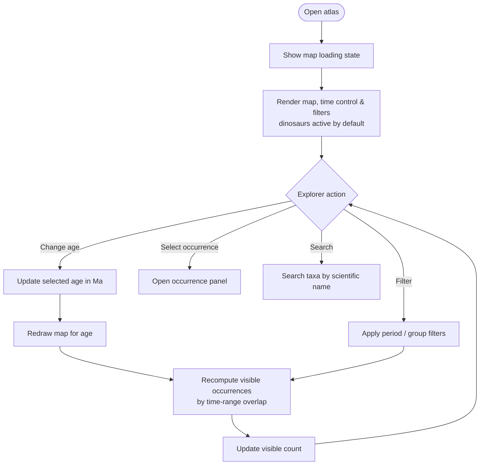
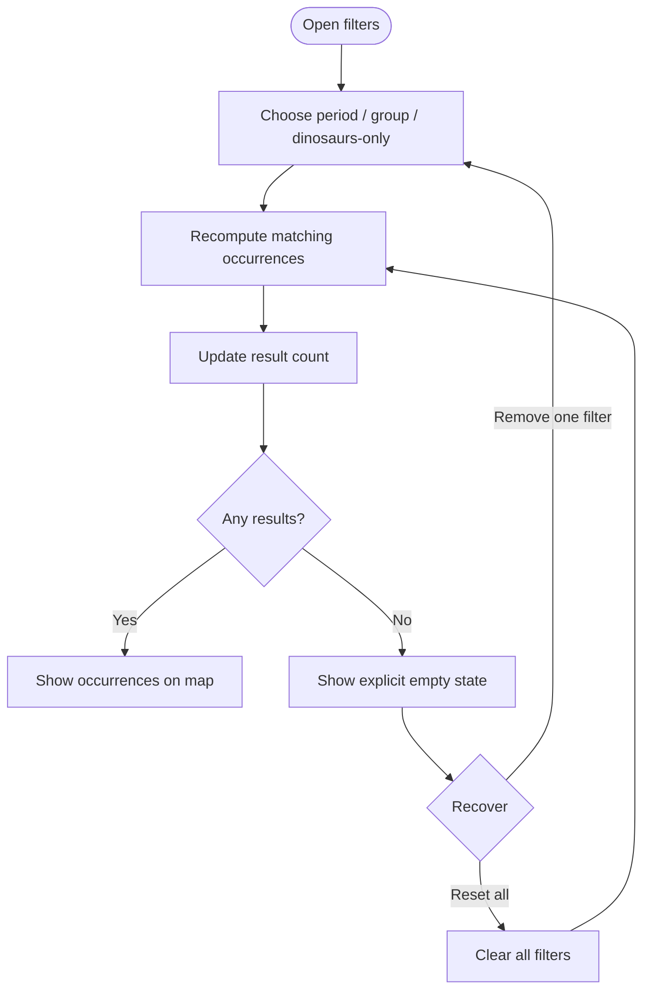

# Activity Diagrams

User-facing flows through the atlas, rendered inline (Mermaid). The specification
PDF renders the same blocks in their spec sections.

---

## Main exploration & age change

**Related requirements:** FONC-010, FONC-020, FONC-040…060, FONC-120…160, CONS-450,
PERF-030, PERF-340, PERF-360.

<!-- pdf-fig: act_explore | Activity — main exploration & age change -->

The selected age steps by geological stage (§1.2); occurrences are shown only when
the age overlaps their time range (FONC-150/160).

---

## Filter application & empty state

**Related requirements:** FONC-780…800, FONC-850…880, FONC-1280, PERF-320, PERF-370.

<!-- pdf-fig: act_filter | Activity — filter application & empty state -->

---

## Occurrence selection to taxon profile

**Related requirements:** FONC-270…290, FONC-990, FONC-1000…1020, FONC-1070,
FONC-1080, CONS-460, CONS-470, PERF-340.

```mermaid
flowchart TD
  A([Occurrence visible on map]) --> B{Point or cluster?}
  B -->|Cluster| C[Zoom / expand cluster]
  C --> D[Select individual occurrence]
  B -->|Point| D
  D --> E[Open occurrence panel<br/>taxon · time · positions · source]
  E --> F[Open taxon profile]
  F --> G[Show profile loading if needed]
  G --> H[Render profile<br/>&#8804; 2 actions from occurrence]
  H --> I[Return to map<br/>&#8804; 1 action · age & filters preserved]
```

<!-- pdf-fig: act_occurrence | Activity — occurrence selection to taxon profile -->

