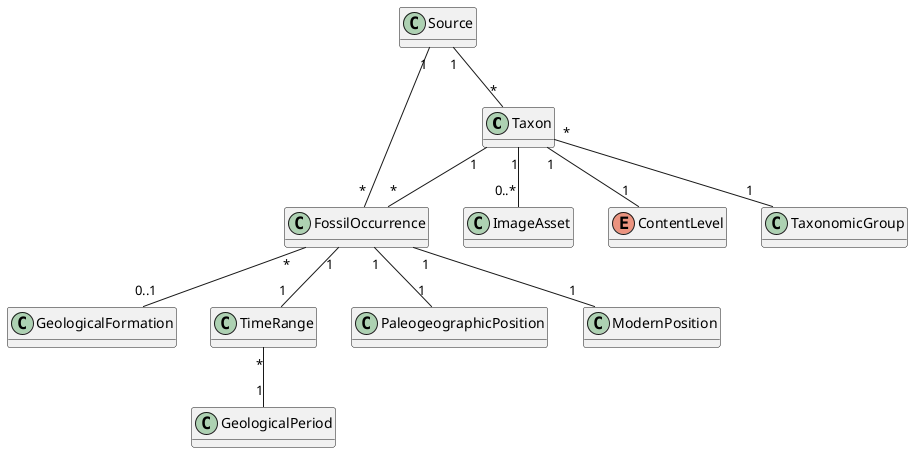

# Domain Model

> Diagram page. Status: **planned**. Source file (planned):
> `../assets/uml/domain-model.puml`. Convention: PlantUML (see
> [README](README.md)).

## Purpose

Capture the core product-facing domain concepts and their relationships, as
implied by the [functional specification](../product/functional-specification.md).
This is a **conceptual** model for shared vocabulary, not a database schema or
class design. Do not over-engineer it.

## Related requirements

- Taxa & classification: FONC-430…FONC-470, FONC-510…FONC-590, FONC-690,
  FONC-710, FONC-720.
- Occurrences: FONC-230, FONC-290, FONC-890…FONC-930, FONC-1100, FONC-1150.
- Time: FONC-100, FONC-150, FONC-160, CONS-200.
- Geography: FONC-220, FONC-580, FONC-910, CONS-110.
- Formations: FONC-940…FONC-970.
- Sources: FONC-1090, FONC-1100, CONS-420.
- Images: FONC-1190…FONC-1240.

## Likely domain concepts

Taken from the specification and glossary. Attributes are indicative.

| Concept | Description | Key associations |
| --- | --- | --- |
| **Taxon** | Classification unit (clade, family, genus, species). Has a scientific name, rank, validity status, content level, taxonomic group membership. | has many FossilOccurrence; has a TimeRange; belongs to TaxonomicGroup; classified by ContentLevel; may have parent/child Taxon; may have ImageAsset; cites Source. |
| **FossilOccurrence** | Documented fossil evidence: discovery of a taxon at a location within a time range. Evidence of discovery, not distribution. | references one Taxon; has a ModernPosition; has a PaleogeographicPosition; has a TimeRange; cites Source; may belong to a GeologicalFormation. |
| **GeologicalFormation** | Named geological unit; may yield fossils. (V1 content.) | has a TimeRange; groups many FossilOccurrence / Taxon. |
| **TimeRange** | Interval between a min and max age boundary (Ma); may be approximate. | associated with Taxon, FossilOccurrence, GeologicalFormation; overlaps a selected age; falls within GeologicalPeriod. |
| **GeologicalPeriod** | Triassic, Jurassic, or Cretaceous (and optional finer stage). | contains TimeRange; partitions the Mesozoic. |
| **PaleogeographicPosition** | Reconstructed past location of a discovery point for a given age. Marked as reconstructed. | derived from ModernPosition; belongs to FossilOccurrence / Taxon. |
| **ModernPosition** | Present-day discovery location (coordinates/region). | belongs to FossilOccurrence; maps to PaleogeographicPosition. |
| **Source** | Identifiable provenance: primary source, database, or editorial synthesis; optional link and consultation date. | cited by Taxon, FossilOccurrence, TimeRange, estimates, ImageAsset. |
| **ImageAsset** | Image for a taxon: fossil photo, artistic reconstruction, or silhouette; carries credit and type. (V1 content.) | belongs to Taxon; cites Source. |
| **ContentLevel** | Enumeration: Occurrence only, Short profile, Detailed profile, Featured species. | classifies Taxon. |
| **TaxonomicGroup** | Grouping used for filtering/exploration (e.g. theropods…); flags main vs secondary content. | groups Taxon; main or secondary scope. |

## Modeling notes (from constraints)

- Distinguish **ModernPosition** from **PaleogeographicPosition** — never conflate
  (CONS-110). Paleo positions are marked reconstructed (FONC-1130).
- **FossilOccurrence** is discovery evidence; the model must not imply a
  continuous distribution area (CONS-150, FONC-1150).
- A **Source** is mandatory for every visible Taxon and FossilOccurrence
  (CONS-060, CONS-070). Distinguish source kinds when known (CONS-420).
- Interpretative attributes (diet, mass, behavior) belong on Taxon but must be
  marked interpretative and never mixed with sourced fields (FONC-670, CONS-440).

## Placeholder for diagram source

## TODO

- [ ] Create `../assets/uml/domain-model.puml`.
- [ ] Confirm multiplicities (e.g. can an occurrence reference more than one
      taxon?) against the specification.
- [ ] Decide how interpretative vs sourced attributes are represented.
- [ ] Keep the model conceptual — no persistence or API assumptions.
