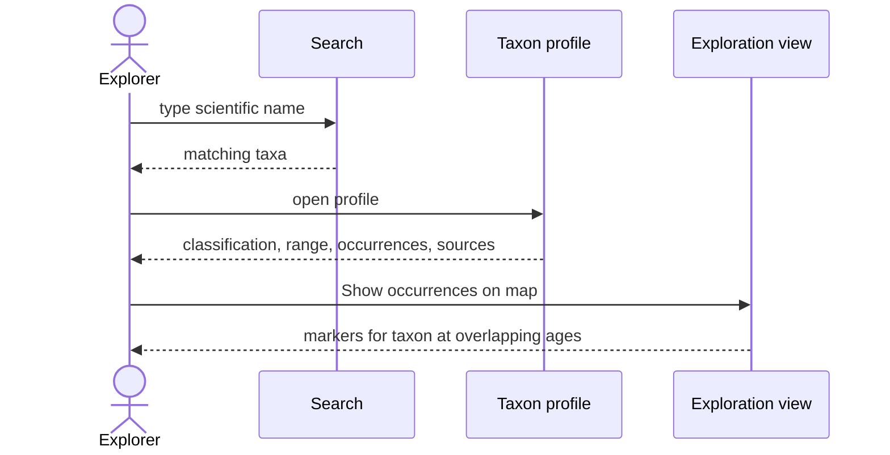

# Sequence Diagrams

Product-facing interactions over time, rendered inline (Mermaid). The specification
PDF renders the same blocks. Participants are the Explorer and interface views; no
backend tier is assumed (data is served from a snapshot — see
[`../design/data-model.md`](../design/data-model.md)).

---

## Occurrence → profile and back

**Related requirements:** FONC-270, FONC-280, FONC-290, FONC-990, FONC-1010,
FONC-1020, FONC-1070, FONC-1080, PERF-340.

```mermaid
sequenceDiagram
  actor Ex as Explorer
  participant Map as Exploration view
  participant Panel as Occurrence panel
  participant Prof as Taxon profile
  Ex->>Map: select occurrence
  Map->>Panel: open (taxon, time, positions, source)
  Ex->>Panel: Open taxon profile
  Panel->>Prof: request profile (age & filters preserved)
  Prof-->>Ex: render (&#8804; 2 actions)
  Ex->>Prof: Back to map
  Prof-->>Map: restore view (&#8804; 1 action)
```

<!-- pdf-fig: seq_occurrence | Sequence — occurrence to profile and back -->

---

## Search → occurrences on map

**Related requirements:** FONC-760, FONC-510, FONC-560, PERF-350.

<!-- pdf-fig: seq_search | Sequence — search to occurrences on map -->

