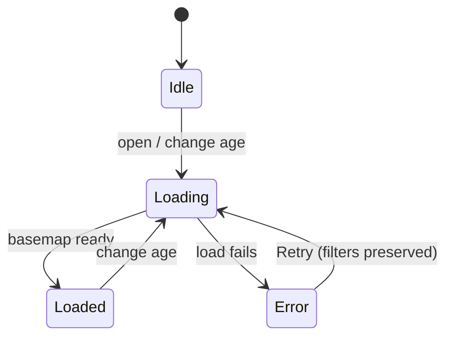
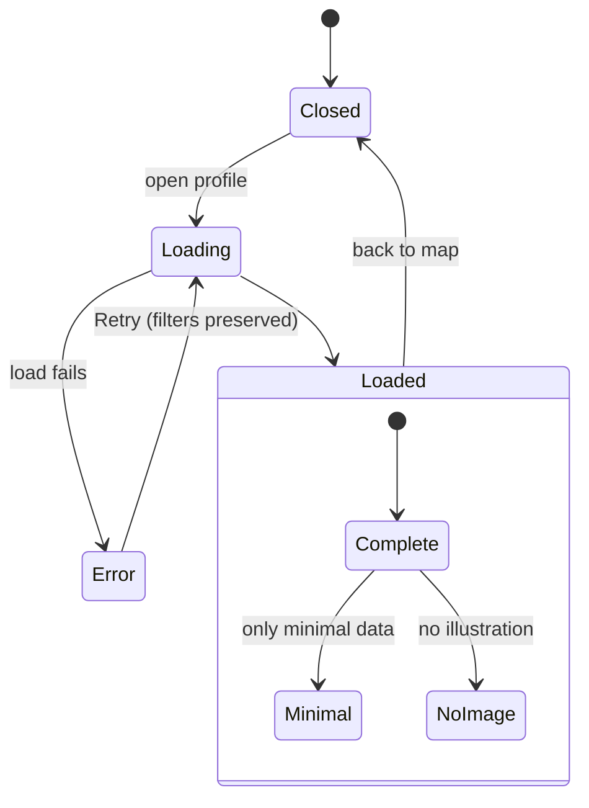
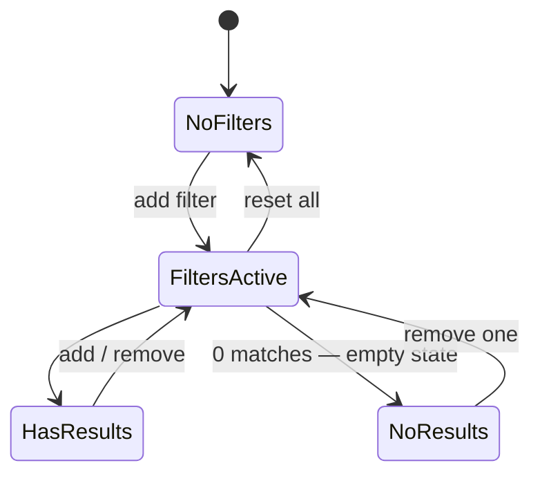

# State Diagrams

Lifecycle of the stateful views, rendered inline (Mermaid). The specification PDF
renders the same blocks.

---

## Map / basemap loading

**Related requirements:** FONC-1260, FONC-1310, FONC-1330, FONC-1340, PERF-050,
PERF-280, PERF-300, PERF-310.

<!-- pdf-fig: state_map | State — map / basemap loading -->

---

## Taxon profile loading

**Related requirements:** FONC-1270, FONC-1300, FONC-1320, FONC-1330, FONC-1240,
FONC-480, PERF-040, PERF-290, PERF-300.

<!-- pdf-fig: state_profile | State — taxon profile loading -->

---

## Active filter set

**Related requirements:** FONC-780…800, FONC-850…880, FONC-1280, FONC-1340,
PERF-320.

<!-- pdf-fig: state_filter | State — active filter set -->

