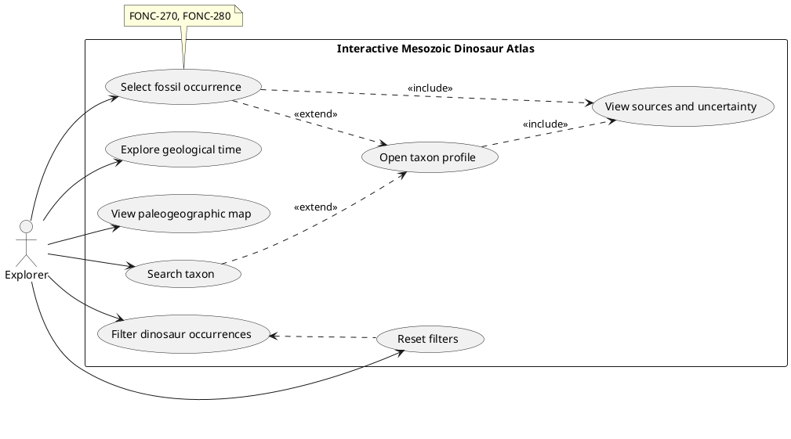

# Use Case Diagram

> Diagram page. Status: **planned**. Source file (planned):
> `../assets/uml/use-case-overview.puml`. Convention: PlantUML (see
> [README](README.md)).

## Purpose

Show the primary actor and the top-level use cases of the atlas — what a user can
do from the main exploration experience, and how the map, time, taxonomy, search,
filtering, and provenance capabilities fit together at a glance.

## Related requirements

- Exploration & access: FONC-010, FONC-030, FONC-080.
- Time: FONC-090, FONC-120.
- Map: FONC-210, FONC-270, FONC-280.
- Filtering: FONC-780, FONC-790, FONC-800, FONC-850, FONC-860, FONC-880.
- Taxonomy & profile: FONC-680, FONC-700, FONC-510, FONC-990.
- Search: FONC-760.
- Provenance/uncertainty: FONC-1090, FONC-1100, FONC-1150.
- Navigation limits: FONC-1070, FONC-1080, CONS-460, CONS-470.

## Expected actors

- **Explorer** — the single primary actor for the MVP: any user browsing the
  atlas. (No authored/admin/data-import actors are in scope for the product-facing
  MVP.)

## Expected use cases

- Explore geological time
- View paleogeographic map
- Filter dinosaur occurrences
- Select fossil occurrence
- Open taxon profile
- Search taxon
- Reset filters
- View sources and uncertainty

Suggested relationships (to confirm when authoring):

- "Open taxon profile" is reachable **from** "Select fossil occurrence" and
  **from** "Search taxon" (≤2 actions from a visible occurrence — FONC-1070).
- "View sources and uncertainty" is an `«include»` of "Select fossil occurrence"
  and "Open taxon profile" (provenance is always present — FONC-1100, FONC-1090).
- "Filter dinosaur occurrences" and "Reset filters" both act on the exploration
  view; "Reset filters" relates to "Filter dinosaur occurrences".
- "Explore geological time" and "View paleogeographic map" are coupled: changing
  the age updates the map (FONC-130).

## Placeholder for diagram source

## TODO

- [ ] Create `../assets/uml/use-case-overview.puml`.
- [ ] Confirm the single-actor assumption (Explorer only) — see
      [open questions](../product/open-questions.md).
- [ ] Add `«include»`/`«extend»` relationships and requirement-ID notes.
- [ ] Render and commit `use-case-overview.svg` (optional).
- [ ] Update the [traceability matrix](../requirements/requirements-traceability.md).
