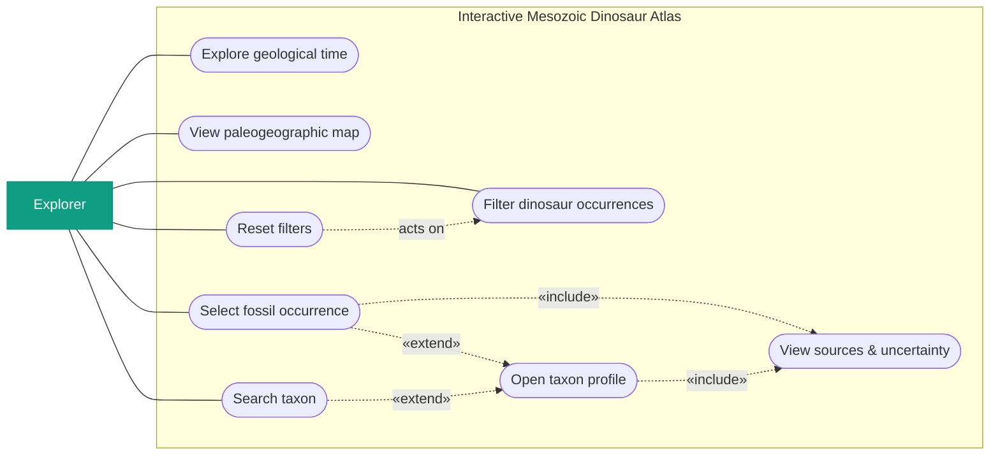

# Use Case Diagram

Primary actor and top-level use cases of the atlas. Rendered inline (Mermaid); the
specification PDF renders the same block.

## Actor & scope

- **Explorer** — the single primary actor for the MVP: any user browsing the
  atlas. No admin / data-import actors are in product-facing scope.

## Related requirements

FONC-010, FONC-030, FONC-080, FONC-090, FONC-120, FONC-210, FONC-270, FONC-280,
FONC-680, FONC-700, FONC-510, FONC-990, FONC-760, FONC-1070, FONC-1080,
FONC-1090, FONC-1100, FONC-1150; CONS-460, CONS-470.

<!-- pdf-fig: usecase | Use case diagram — Explorer and the top-level use cases -->

- Opening a taxon profile is reachable **from** selecting an occurrence and **from**
  searching (≤ 2 actions from a visible occurrence — FONC-1070).
- "View sources & uncertainty" is `«include»`d by occurrence selection and profile
  viewing — provenance is always present (FONC-1090, FONC-1100).
